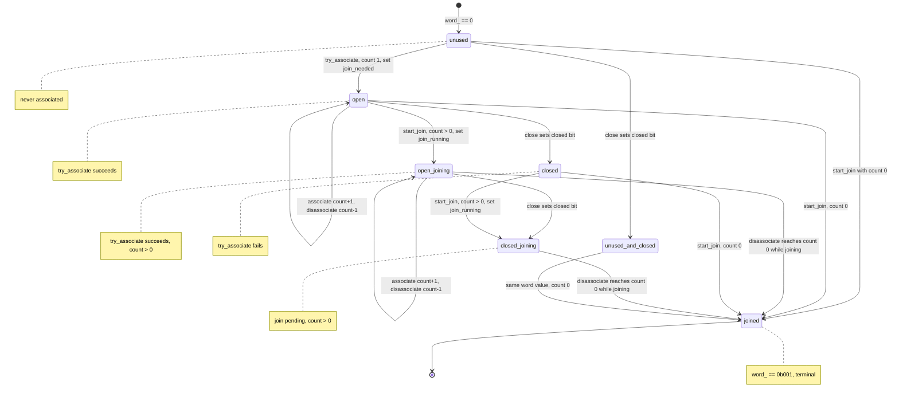

# Counting Scopes And Spawn

`simple_counting_scope` and `counting_scope` maintain an association count and
a small state machine. `close()` prevents new associations, and `join()`
completes after the count reaches zero. Starting a join does not immediately
close a non-empty open scope; associations are still allowed while the scope is
open and joining.
`counting_scope` additionally owns an `inplace_stop_source`; its token wraps
child senders so scope stop requests are visible through `get_stop_token`.

## Why a single packed word

The physical-machine report (`.artifacts/REPORT.md` §4, §8.3) measured
same-protocol probes in which bexec's counting scope is 23–39% slower than
stdexec: `spawn_just` +39%, `join_empty` +38%, `associate_cycle` +23%. The root
cause is structural: bexec keeps **three separate atomics** — `state_`,
`count_`, and the `joiners_` Treiber stack (plus the `unused_` flag), see
`include/bexec/counting_scope.hpp:238-241` — so every associate/disassociate
performs multiple read-modify-write operations on different words, and the
"count reached zero" and "state says joining" decisions live in different
locations with a window between them. stdexec instead packs `(count << 3) |
state` into a single `atomic<std::size_t>` (`__counting_scopes.hpp:543-544`),
so each decision is validated by one CAS. REPORT.md §9 (recommendation 2)
concludes: pack `state_ + count_` into one word; expected recovery 20–40%.

With everything in one word, each RMW validates the *entire* `(count, state)`
pair with a single CAS, the transient states that the old multi-atomic version
had to defensively re-check become unrepresentable, and the
associate/disassociate hot path shrinks to one RMW each.

This section specifies the packed-atomic concurrency protocol completely, so
that `include/bexec/counting_scope.hpp` can be rewritten from it alone. The
public API (`simple_counting_scope`, `association`, `token`, `join_sender`,
`counting_scope`, `spawn`, `spawn_future`) does not change — only the internal
representation and algorithms.

## Packed state word

The `(count, state)` pair is stored in a single `std::atomic<std::size_t>`:

```
word = (count << 3) | state_bits          // state_bits occupies the low 3 bits
```

State bit values (one bit each):

| Constant            | Value | Meaning                                    |
|---------------------|-------|--------------------------------------------|
| `closed_bit`        | `1`   | scope refuses new associations             |
| `join_needed_bit`   | `2`   | scope has been used (count > 0 or was > 0) |
| `join_running_bit`  | `4`   | at least one join sender is pending        |

State combinations (mirrors stdexec's reachable-states table,
`__counting_scopes.hpp:534-542`):

| `state_bits` | Binary  | Name                | Count   |
|--------------|---------|---------------------|---------|
| `0`          | `0b000` | unused              | 0       |
| `1`          | `0b001` | unused-and-closed / joined | 0 |
| `2`          | `0b010` | open                | ≥ 0     |
| `3`          | `0b011` | closed              | ≥ 0     |
| `6`          | `0b110` | open-and-joining    | > 0     |
| `7`          | `0b111` | closed-and-joining  | > 0     |

Unreachable combinations:

- `state_bits == 4` (`0b100`) and `5` (`0b101`): `join_running_bit` is only
  ever OR-ed onto a word that already has `join_needed_bit` set (a join can
  only start when count > 0), so `join_running` without `join_needed` is never
  constructed.
- `state_bits == 1` with count > 0: the joined encoding `closed_bit` is only
  produced with count 0; a closed scope with outstanding work is `3` or `7`.
- `state_bits ∈ {6, 7}` (joining) with count 0: the last disassociate that
  brings the count to zero atomically rewrites the whole word to `closed_bit`
  (joined), so a joining state with an empty count never exists.

The old encoding maps onto the new one as: `state::open` → `2`,
`open_joining` → `6`, `closed` → `3`, `closed_joining` → `7`, `joined` → `1`
(count 0). The separate `unused_` atomic bool (`counting_scope.hpp:240`) is
absorbed: "unused" is simply `word == 0`.

Naming shortcuts used below (all `constexpr`, no atomics):

```cpp
std::size_t count_of(std::size_t w) noexcept { return w >> 3; }
std::size_t state_of(std::size_t w) noexcept { return w & 7; }
std::size_t make_word(std::size_t count, std::size_t state) noexcept {
  return (count << 3) | state;
}
bool is_open(std::size_t w)    noexcept { return (w & closed_bit) == 0; }
bool is_closed(std::size_t w)  noexcept { return !is_open(w); }
bool is_joining(std::size_t w) noexcept { return (w & join_running_bit) != 0; }
bool is_joined(std::size_t w)  noexcept { return w == closed_bit; }  // count == 0
```

Storage:

```cpp
static constexpr std::size_t closed_bit       = 1;   // 0b001
static constexpr std::size_t join_needed_bit  = 2;   // 0b010
static constexpr std::size_t join_running_bit = 4;   // 0b100
static constexpr std::size_t max_associations =
    std::numeric_limits<std::size_t>::max() >> 3;

std::atomic<std::size_t> word_{0};   // (count << 3) | state_bits; 0 == unused
std::atomic<detail::scope_join_waiter*> joiners_{nullptr};
```

**Overflow.** `try_associate` fails cleanly ("no effect") when
`count_of(word) == max_associations`, per the C++26 contract. The limit is
2⁶¹−1 associations on 64-bit platforms (2²⁹−1 on 32-bit), unreachable in
practice; no saturating counter is needed and the check rides for free inside
the existing CAS loop. This replaces the current `assert`-and-wrap behavior in
`increment_count()` (`counting_scope.hpp:183-186`), which would silently wrap
and corrupt the count.

**Invariants.**

- **I1** — `word = (count << 3) | state_bits` with
  `state_bits ∈ {0, 1, 2, 3, 6, 7}`.
- **I2** — joining (`state_bits ∈ {6, 7}`) ⇒ `count > 0`.
- **I3** — `word == closed_bit` (joined) is terminal: no operation ever writes
  it to anything else, and `count == 0` from then on.
- **I4** — `joiners_` holds `nullptr`, a pushed waiter list, or the drained
  sentinel (`static_cast<detail::scope_join_waiter*>(this)`); once the
  sentinel is installed, no push ever succeeds again.
- **I5** — every successfully pushed waiter is completed exactly once.
- **I6** — completion is driven only by: (a) the disassociate whose CAS
  produces `word == closed_bit` (drains the list), (b) `start_join`'s
  count == 0 path (inline), (c) `register_joiner` observing the sentinel
  (inline). `close()` never completes a join.
- **I7** — there is exactly one drain of `joiners_` per scope, ever.

## State diagram

Over the packed word (state bits shown; count travels along the
associate/disassociate self-loops):



Note two simplifications over the old five-state machine: an open scope with
count 0 goes to `joined` in one CAS (the old code hopped
`open → open_joining → closed_joining → joined`), and
`open_joining/closed_joining → joined` happens inside the last disassociate's
CAS instead of a follow-up state CAS.

## Operations

All CAS loops use `compare_exchange_weak` on `word_`; on failure the CAS
reloads `word`, and the loop re-derives the decision from the fresh value.

### `try_associate`

Preserved semantics: an associate that races `close()` either fails (the close
linearizes first) or succeeds (the associate linearizes first); close never
fails or blocks. Accepted states are unused, open, and open-and-joining.

```cpp
bool try_associate() noexcept {
  std::size_t bits = word_.load(std::memory_order_acquire);
  for (;;) {
    if (is_closed(bits) || count_of(bits) == max_associations) {
      return false;                       // no effect
    }
    std::size_t next = make_word(count_of(bits) + 1,
                                 state_of(bits) | join_needed_bit);
    // state_of(bits) | join_needed maps: 0 -> 2 (unused -> open), 2 -> 2, 6 -> 6.
    if (word_.compare_exchange_weak(bits, next,
                                    std::memory_order_acquire,   // success
                                    std::memory_order_acquire)) { // failure
      return true;
    }
  }
}
```

The CAS replaces the old four-step sequence (load state, `fetch_add` count,
store `unused_`, re-load state, plus a rollback path that called
`release_count()`, `counting_scope.hpp:293-307`); a failed CAS has nothing to
undo.

### `disassociate`

Called by `association::reset()` and `token::disassociate()`. Precondition:
count > 0. The decrement and the joined transition are decided **inside one
CAS**: if the decrement reaches zero while a join is running, the word becomes
exactly `closed_bit` (joined), dropping `join_needed_bit` and
`join_running_bit` in the same write.

```cpp
void disassociate() noexcept {
  std::size_t bits = word_.load(std::memory_order_relaxed);
  for (;;) {
    assert(count_of(bits) > 0);           // precondition
    std::size_t n = count_of(bits) - 1;
    std::size_t next = (n == 0 && is_joining(bits))
        ? closed_bit                      // joined: 0b001, drops join bits
        : make_word(n, state_of(bits));
    if (word_.compare_exchange_weak(bits, next,
                                    std::memory_order_acq_rel,     // success
                                    std::memory_order_relaxed)) {  // failure
      if (next == closed_bit) {
        complete_registered_joins();      // I6a: exactly once, ever
      }
      return;
    }
  }
}
```

A disassociate whose decrement does **not** reach zero (or where no join is
running) leaves the state bits untouched; the scope simply ends up drained
(open/closed with count 0) and can be re-associated or destructed (see
"Destruction").

### `close`

Setting the closed bit is a single `fetch_or`, valid from every state:
unused → unused-and-closed, open → closed, open-and-joining →
closed-and-joining, otherwise no effect (bit already set). No CAS loop, and —
per I6 — no joiner completion logic.

```cpp
void close() noexcept {
  word_.fetch_or(closed_bit, std::memory_order_release);
}
```

### `start_join` and `register_joiner`

`join_sender::operation::start()` calls `start_join(*this)`. Return `true`
means the join completes inline (the caller delivers `set_value()` on the
receiver immediately, as today at `counting_scope.hpp:396-400`); return `false`
means the waiter was registered and will be completed later through
`complete_deferred()`.

```cpp
bool start_join(detail::scope_join_waiter& w) noexcept {
  std::size_t bits = word_.load(std::memory_order_relaxed);
  for (;;) {
    if (count_of(bits) == 0) {
      // No outstanding work: force joined regardless of open/closed/unused.
      // This also closes an open empty scope (same end state as the old
      // open -> open_joining -> closed_joining -> joined path).
      if (word_.compare_exchange_weak(bits, closed_bit,
                                      std::memory_order_acq_rel,    // success
                                      std::memory_order_relaxed)) { // failure
        return true;                  // inline completion
      }
      continue;                       // an associate raced in; re-evaluate
    }
    // count > 0: mark joining. join_running is a flag, not a counter;
    // concurrent joiners OR the same bit idempotently.
    if (word_.compare_exchange_weak(bits, bits | join_running_bit,
                                    std::memory_order_relaxed,     // success
                                    std::memory_order_relaxed)) {  // failure
      return !register_joiner(w);   // false => registered, deferred completion
    }
  }
}
```

```cpp
bool register_joiner(detail::scope_join_waiter& w) noexcept {
  // Returns false iff the list was already drained (sentinel observed);
  // the caller must then complete the join inline and must NOT link the node.
  auto* head = joiners_.load(std::memory_order_acquire);
  for (;;) {
    if (head == static_cast<detail::scope_join_waiter*>(this)) {
      return false;                   // drained: complete inline
    }
    w.next = head;
    if (joiners_.compare_exchange_weak(head, &w,
                                       std::memory_order_acq_rel,   // success
                                       std::memory_order_acquire)) { // failure
      return true;
    }
  }
}
```

### `complete_registered_joins`

The joiner list is a Treiber stack of `detail::scope_join_waiter*` (plain
non-atomic `next` links), with `static_cast<detail::scope_join_waiter*>(this)`
as the **drained sentinel**. The sentinel is what makes late registration
safe without any re-check pass.

```cpp
void complete_registered_joins() noexcept {
  // Called exactly once (I7), by the disassociate whose CAS produced
  // word == closed_bit. The exchange both empties the list and installs
  // the terminal sentinel.
  auto* list = joiners_.exchange(static_cast<detail::scope_join_waiter*>(this),
                                 std::memory_order_acq_rel);
  while (list != nullptr) {
    auto* w = std::exchange(list, list->next);  // advance cursor BEFORE completing
    w->complete_deferred();                     // may destroy w
  }
}
```

The advance-cursor-before-completing discipline is mandatory:
`complete_deferred()` starts the join receiver's scheduled completion and the
waiter (a subobject of the join operation state) may be destroyed by its owner
before the loop reads `next` again. This matches the current
`complete_all()` at `counting_scope.hpp:229-236`.

### Destruction

`~simple_counting_scope()` loads `word_` with acquire and terminates unless
**count is 0 and no join is in flight**:

```cpp
std::size_t bits = word_.load(std::memory_order_acquire);
if ((bits & join_running_bit) != 0 || count_of(bits) != 0) {
  std::terminate();
}
```

This admits `word_` values 0 (unused), 1 (unused-and-closed / joined), and
drained 2 / 3 (open/closed with count 0). It preserves current bexec behavior
(`ensure_destructible`, `counting_scope.hpp:94-104`, where the `unused_` flag
is re-set when the count drains) and is deliberately more permissive than the
C++26 contract that stdexec implements (stdexec terminates on drained open and
closed scopes; see Deviations). Tokens and associations remain non-owning
views that must not outlive the scope.

## Interleavings

Each table shows the modification order of the single packed word (or of
`joiners_`). "Why packed" names the window the old three-atomic version had.

### 1. `try_associate` vs `close` — associate loses

| # | Thread A (`try_associate`)                | Thread B (`close`)            | `word_` |
|---|-------------------------------------------|-------------------------------|---------|
| 1 | load acquire → 0 (unused, count 0)        |                               | 0       |
| 2 |                                           | `fetch_or(closed_bit)` release| 1       |
| 3 | CAS(expected 0 → 10) **fails**, reloads   |                               | 1       |
| 4 | reload acquire → 1; `is_closed` → return false |                          | 1       |

Result: associate fails, nothing to undo. **Why packed:** the old version had
already done `count_.fetch_add(1)` before re-reading `state_`, so it needed a
rollback path (`release_count()` + `try_complete_join()`); here the CAS
validates count *and* state together, so a lost race leaves no residue.

### 1b. `try_associate` vs `close` — associate wins

| # | Thread A                                  | Thread B                      | `word_` |
|---|-------------------------------------------|-------------------------------|---------|
| 1 | load acquire → 0                          |                               | 0       |
| 2 | CAS 0 → 10 (count 1, open) acquire ✓      |                               | 10      |
| 3 |                                           | `fetch_or(closed_bit)` → 11   | 11      |

Result: associate succeeds; the scope is closed with one outstanding op; the
last disassociate drains to 3 (closed, count 0). Both orders are valid
linearizations; this matches current bexec semantics exactly.

### 2. Last disassociate vs concurrent joiner registration

Case (a) — the joiner's `join_running` CAS wins first:

| # | Thread J (join)                           | Thread D (disassociate)       | `word_` |
|---|-------------------------------------------|-------------------------------|---------|
| 1 | load relaxed → 10 (count 1, open)         |                               | 10      |
| 2 |                                           | load relaxed → 10             | 10      |
| 3 | CAS 10 → 14 (`|join_running`) ✓ relaxed   |                               | 14      |
| 4 |                                           | CAS(expected 10) **fails**; reload → 14 | 14 |
| 5 |                                           | n = 0, joining → next = 1; CAS 14 → 1 ✓ acq_rel | 1 |
| 6 |                                           | `joiners_.exchange(this)` → nullptr, installs sentinel | sentinel |
| 7 | `register_joiner`: load acquire → sentinel → return false → **completes inline** | | — |

Case (b) — registration lands before the drain:

| # | Thread J                                  | Thread D                      | `joiners_` |
|---|-------------------------------------------|-------------------------------|------------|
| 1 | CAS 10 → 14 ✓ (as above)                  | CAS(expected 10) fails; reload 14 | —      |
| 2 |                                           | CAS 14 → 1 ✓ acq_rel          | —          |
| 3 | `register_joiner`: load → nullptr; push CAS ✓ acq_rel |                   | &J         |
| 4 |                                           | `exchange(this)` → &J; D completes J's waiter | sentinel |

Both cases complete J's join exactly once. **Why packed:** the old version
decided count on `count_.fetch_sub` and joining on a separate `state_` CAS, so
the intermediate "count 0 but state not yet joined" was observable and every
participant (`try_complete_join`, `push_joiner`'s post-push re-check) had to
handle it. The packed RMWs on `word_` are totally ordered, so "D decremented
to 0 without seeing joining" and "J set `join_running`" cannot both win: if
D's CAS first, J's CAS fails and J re-evaluates (count 0 → inline joined); if
J's CAS first, D's CAS fails, D reloads, sees joining, and its
decrement-to-zero rewrites the word to `closed_bit` and drives the drain.

### 3. `close` vs `close`

Both threads execute `fetch_or(closed_bit, release)`. RMWs on the same atomic
serialize in its modification order; the second is idempotent (bit already
set). No loops, no CAS contention on state transitions. The old version ran
two CAS loops over the five-state enum and the loser retried to a no-op.

### 4. Joiner push vs completer drain (orphan analysis)

Question: can a push be orphaned *after* completion started? **No.**

| # | Thread J (register)                       | Thread D (drain)              | `joiners_` |
|---|-------------------------------------------|-------------------------------|------------|
| 1 | load acquire → nullptr                    |                               | nullptr    |
| 2 | `w.next = nullptr`; push CAS nullptr → &J ✓ |                             | &J         |
| 3 |                                           | `exchange(this)` acq_rel → returns &J | sentinel |
| 4 |                                           | walk &J, `complete_deferred()` | sentinel   |

Push-after-drain order:

| # | Thread J                                  | Thread D                      | `joiners_` |
|---|-------------------------------------------|-------------------------------|------------|
| 1 |                                           | `exchange(this)` → nullptr    | sentinel   |
| 2 | load acquire → **sentinel**               |                               | sentinel   |
| 3 | return false → J completes inline, node never linked |                    | sentinel   |

A push either precedes the exchange (its node is returned by the exchange and
completed by the drainer) or follows it (the pusher observes the sentinel and
completes itself without linking). Since the drain happens exactly once (I7)
and the sentinel is permanent, no pushed node can be stranded on a list nobody
will drain. Ordering: J's successful push (release) synchronizes with D's
exchange (acquire), so D sees the fully constructed waiter; J's sentinel
observation (acquire) synchronizes with D's exchange (release) and transitively
with D's acq_rel `word_` CAS, so J's inline completion happens after the child
operations' results are visible. The old version covered the same race with a
post-push `load_state() == joined` re-check plus a second
`exchange(nullptr)` drain (`counting_scope.hpp:150-160`); the sentinel makes
both unnecessary.

### 5. Join on an already-joined or drained scope

`start_join` observes `count == 0` and CASes the word to `closed_bit`:

- from `closed_bit` (already joined): CAS `1 → 1` succeeds trivially → return
  true → inline `set_value`. (Optional fast path: early-return on
  `bits == closed_bit`; behaviorally identical.)
- from `0` (fresh scope): `0 → 1`; the scope ends unused-and-closed and
  remains destructible.
- from `2` / `3` (drained): `→ 1`. No drain is triggered and none is needed:
  by I2/I6 no waiter can be registered when count is 0 — any registration
  epoch ended in the unique drain.

No scheduler hop is consumed on the inline path, matching current behavior.

### 6. Non-last disassociate racing the completion decision

Count 2, closed-and-joining (`word_` = 22 = (2<<3)|6):

| # | Thread D1                                 | Thread D2                     | `word_` |
|---|-------------------------------------------|-------------------------------|---------|
| 1 | load relaxed → 22                         | load relaxed → 22             | 22      |
| 2 | n = 1 → state unchanged; CAS 22 → 14 ✓ acq_rel |                          | 14      |
| 3 |                                           | CAS(expected 22) **fails**; reload → 14 | 14 |
| 4 |                                           | n = 0, joining → next = 1; CAS 14 → 1 ✓ | 1 |
| 5 |                                           | drain `joiners_`, complete registered joins | — |

D1's intermediate write (count 1, joining) is a legitimate state other threads
may observe; only the decrementer whose own CAS reaches zero *and* saw
joining completes the join. If no join is running (e.g. `word_` 18 = count 2,
open), the decrements are 18 → 10 → 2 and nothing completes: the scope ends
open and drained, still associable, destructible. **Why packed:** the old
version split "reached zero" (`count_.fetch_sub`) from "become joined"
(`state_` CAS inside `try_complete_join`), so every observer could see the
transient "count 0, state closed_joining but not yet joined" and had to
re-derive the decision; the packed CAS makes the transition atomic.

## The joiner stack stays separate

`joiners_` remains its own atomic and is **not** folded into `word_`:

- The hot path (`try_associate`/`disassociate`, one RMW each on `word_`) runs
  per operation; the joiner list is touched once per join-sender start and
  once at completion. Folding the list into the word would force every
  associate/disassociate CAS to preserve list bits for no benefit.
- This matches stdexec: the join/running *flags* live in the packed word, but
  the *list* of registered join operations is a separate atomic
  (`__registered_join_ops_`, `__counting_scopes.hpp:554`).
- bexec's waiter type `detail::scope_join_waiter` (non-atomic `next`, virtual
  `complete_deferred()`, completed via the joiner's start scheduler, as at
  `counting_scope.hpp:405-425`) is unchanged; only the scope-side push/drain
  protocol changes (sentinel instead of nullptr-drain + re-check).

### ABA on the joiner stack

Classic Treiber ABA requires a pop that frees a node and a later push that
reuses its address while another thread still holds the stale pointer. This
stack has **no individual pops**: the head changes only through push CASes and
the single terminal `exchange(sentinel)`. Waiter nodes are per-join-operation
subobjects: address-stable, non-movable, and never destroyed while reachable
from `joiners_` — a node is unlinked only by being returned from the drain
exchange, and the drain is unique (I7) and permanent (I4). After the sentinel
is installed no push CAS ever succeeds, so there is no window in which a
freed node's address could be observed as a plausible head. `exchange`-based
whole-list drain therefore avoids ABA by construction.

## Memory ordering

| Access | Ordering | Reason |
|---|---|---|
| `word_.load` in destructor | acquire | synchronize with the acq_rel CAS that produced joined, so child results are visible on the destroying thread |
| `word_.load` (associate, first peek) | acquire | observe a concurrent `close()` with synchronization |
| `word_` CAS in `try_associate` | acquire / acquire | failure needs acquire to sync with close's release `fetch_or`; failure may not be stronger than success, so acquire both |
| `word_.fetch_or` in `close` | release | publish closure to failing associates; the closer only sends a signal |
| `word_.load` (disassociate, first peek) | relaxed | the CAS loop synchronizes; avoids a redundant fence |
| `word_` CAS in `disassociate` | acq_rel / relaxed | release publishes the completed child's effects; acquire lets the last decrementer safely drain the joiner list; on failure we retry and re-sync |
| `word_.load` (start_join) | relaxed | both CAS paths provide the synchronization |
| `word_` CAS (join, count 0 → joined) | acq_rel / relaxed | release publishes closed to later associates; acquire consumes the completed children's effects |
| `word_` CAS (join, set `join_running`) | relaxed / relaxed | synchronization is carried by the joiner list (see below) |
| `joiners_.load` (register) | acquire | observing the sentinel must happen-after every disassociate |
| `joiners_` CAS push | acq_rel / acquire | release publishes the waiter to the drainer; acquire on failure to re-observe a possible sentinel |
| `joiners_.exchange` (drain) | acq_rel | acquire: happens-after all pushes and all child completions; release: late registerers that observe the sentinel happen-after the drain |

Note on the CAS failure order: per [atomics.order] the on-failure argument
must not be stronger than the on-success argument. (stdexec's source comment
at `__counting_scopes.hpp:367-369` phrases this rule backwards; its code is
nevertheless correct. This doc states the rule as written in the standard.)

Why the relaxed `join_running` CAS is still correct: the joining thread does
not synchronize with the associated operations on `word_`; it synchronizes on
`joiners_` instead. Every disassociate is acq_rel; the last decrementer drains
the list with acq_rel; therefore every count decrement strongly
happens-before the completion of every registered join, even though the
`join_running` CAS itself is relaxed. (Same argument as stdexec,
`__counting_scopes.hpp:509-518`.)

## Association and spawn senders

`associate(sender, token)` first wraps the input sender through the token and
then attempts to obtain an association. It returns an unspecified pipeable
sender adaptor result rather than exposing a concrete associated-sender type.
When association is accepted, connecting that sender creates an operation that
owns the association and forwards the wrapped child completions. When
association is rejected, starting its operation sends `set_stopped()` without
connecting or starting the child. The adaptor therefore adds `set_stopped()` to
the wrapped sender's completion set.

`spawn(sender, token, env)` is an independent detached consumer CPO. Its
heap-backed state first connects `token.wrap(sender)` to the detached receiver,
then calls `token.try_associate()`. Only a successful association starts the
already-connected operation; a rejected association destroys the state without
starting the child. The detached receiver accepts only `set_value()` and
`set_stopped()`, and either terminal signal releases the association after the
allocation is no longer used.

`spawn_future(sender, token, env)` has the same connection-before-association
order. Its future state connects the wrapped child, attempts association, and
starts only on success; otherwise it stores `set_stopped()`. A successful child
terminal signal is stored in a `std::variant` of decayed completion tuples.

The returned future sender is move-only and one-shot. Its heap state supports
three serialized operations:

- `complete`: records that the child finished and delivers to a registered
  consumer, if any.
- `consume`: registers the future receiver, or immediately delivers an already
  stored result.
- `abandon`: requests stop through the future state's internal stop source if
  the child has not completed; otherwise it destroys the state.
- `try_cancel`: reacts to downstream stop by requesting child stop and
  completing a registered future receiver with `set_stopped()`.

Abandoning the future does not complete the future receiver with stopped. It
only requests stop for the child. The scope association remains held until the
child sends its terminal signal and the future state is destroyed.

State destruction deliberately moves the association out before destroying and
deallocating the state, so the association is released only after allocator
storage is no longer used.

These consumers are unaffected by the packed-word redesign: they interact with
the scope only through `try_associate()` / `disassociate()`.

## Attribution

The packed state word design is adapted from stdexec (tag nvhpc-26.05), file
include/stdexec/__detail/__counting_scopes.hpp, Copyright NVIDIA Corporation,
Apache License v2.0 with LLVM Exceptions. (The file header additionally
credits Ian Petersen, 2025.) bexec is MIT-licensed; all prose and pseudocode
here was written fresh for bexec, referencing the algorithm by location.
Verified line ranges in
`/tmp/stdexec-26.05/include/stdexec/__detail/__counting_scopes.hpp`:

- layout comment and `max_associations`: :253-260
- destructor (`__destructible` rationale): :270-293
- `close()` (`fetch_or`, release): :295-313
- `__try_associate` (acquire/acquire CAS loop): :315-381
- `__disassociate` (acq_rel/relaxed CAS loop, joined transition, plus the
  note explaining why a `fetch_sub`-then-`store` transliteration is racy):
  :383-455
- `__start_join_sender` (count 0 → joined CAS; `|join_running` relaxed CAS):
  :457-525
- state-bit constants `__closed = 1`, `__join_needed = 2`,
  `__join_running = 4`: :528-530
- encoding comment and `__bits_` storage (`(count << 3) | (state & 7)`):
  :532-544
- joiner list storage and sentinel documentation: :546-554
- state predicates, `__count`/`__state`/`__make_bits`: :559-634
- `__register` (acq_rel/acquire push), `__dequeue_registered_join_operations`
  (acq_rel `exchange(this)`), `__complete_registered_join_operations`:
  :636-708

## Deviations from stdexec

1. **Naming and style.** `word_` / `closed_bit` / `join_needed_bit` /
   `join_running_bit` / `count_of` / `state_of` / `make_word` instead of
   stdexec's `__bits_` / `__closed` / `__join_needed` / `__join_running` /
   `__count` / `__state` / `__make_bits`: bexec uses Google-style names and
   avoids reserved double-underscore identifiers.
2. **Destructor leniency.** stdexec (and the C++26 contract it cites)
   terminates unless the word is exactly `0` or `closed_bit`, i.e. a drained
   open (`2`) or closed (`3`) scope after use is a `std::terminate()`. bexec
   has always permitted destroying a used-but-drained scope (via the `unused_`
   flag) and this redesign preserves that public behavior: the rule is
   `count == 0 && !joining`. Do not "fix" this while implementing; changing it
   would be an observable API change.
3. **Overflow behavior.** `try_associate` fails cleanly at
   `max_associations` (stdexec/spec behavior). Current bexec instead asserts
   in `increment_count` and would wrap; the redesign adopts the
   stdexec rule, which is strictly safer and unobservable in practice.
4. **Joiner stack protocol.** stdexec installs a `this` sentinel with the
   single drain `exchange`; bexec's current code drains with
   `exchange(nullptr)` and covers late pushes with a post-push state re-check
   plus a second `exchange(nullptr)` drain (`counting_scope.hpp:150-160`). The
   redesign adopts stdexec's sentinel: exactly-once completion by
   construction, no re-check pass, no second drain. The waiter node type is
   unchanged.
5. **Memory orders.** The current code uses `seq_cst` everywhere (member
   constant `memory_order`, `counting_scope.hpp:242`); the redesign adopts
   stdexec's differentiated orders (see the table). Both are correct; the
   differentiated orders remove fences from the hot path, which is where the
   23–39% gap is expected to be recovered.
6. **Association object.** stdexec's `__association_t` wraps a
   `std::unique_ptr` with a disassociating deleter; bexec keeps its own
   `association` class with `scope_` pointer and `reset()`. Public API is
   unchanged and untouched by this redesign.
7. **Documentation correction.** stdexec's comment on the
   associate CAS's failure ordering (`:367-369`) states the
   failure-stronger/success-weaker rule inverted; the code is correct. This
   doc states the [atomics.order] rule correctly (failure may not be stronger
   than success).
8. **Deferred join completion mechanism.** Not a deviation, recorded for the
   implementer: like stdexec's `__join_state` (:117-178), bexec's join
   operation pre-computes its scheduler and completes by connecting
   `schedule(scheduler_)` to a final receiver inside `complete_deferred()`;
   the packed-word protocol only changes *when* `complete_deferred()` runs
   (drain, sentinel observation, or inline path), never *how*.
