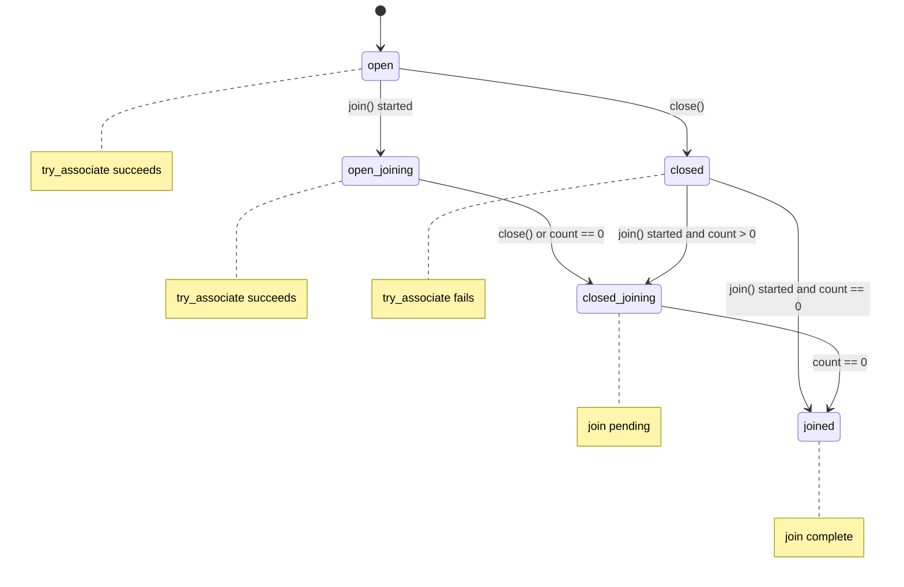

# Counting Scopes And Spawn

`simple_counting_scope` and `counting_scope` maintain an association count and
a small state machine. `close()` prevents new associations, and `join()`
completes after the count reaches zero. Starting a join does not immediately
close a non-empty open scope; associations are still allowed while the scope is
open and joining.
`counting_scope` additionally owns an `inplace_stop_source`; its token wraps
child senders so scope stop requests are visible through `get_stop_token`.

The simple scope state is monotonic; `unused` is tracked as a separate flag
instead of as a state value. `try_associate()` accepts only `open` and
`open_joining`, which lets the implementation test association eligibility by
state ordering. Open states never jump directly to `joined`: they first move to
`closed_joining`, which prevents successful new associations, and only then
recheck the count before completing the join. A closed scope whose count is
already zero may move directly to `joined` because no new count can be added.

Scope destruction is intentionally strict and follows the C++26
`simple_counting_scope` / `counting_scope` contract. After a scope has accepted
work, callers must call `close()` and wait for a started `join()` sender to
complete before destruction. Destruction is valid only for an `unused`,
`unused-and-closed`, or `joined` scope; the standard contract requires
`std::terminate()` for every other state. Tokens and associations are
non-owning, so they must not be retained or used after the scope is destroyed.

bexec enforces this invariant with `std::terminate()` in every build
configuration. This is a fail-fast lifetime boundary, not an alternative scope
policy.

`associate(sender, token)` first wraps the input sender through the token and
then attempts to obtain an association. It returns an unspecified pipeable
sender adaptor result rather than exposing a concrete associated-sender type.
When association is accepted, connecting that sender creates an operation that
owns the association and forwards the wrapped child completions. When
association is rejected, starting its operation sends `set_stopped()` without
connecting or starting the child. The adaptor therefore adds `set_stopped()` to
the wrapped sender's completion set.

`spawn(sender, token, env)` is an independent detached consumer CPO. Its
heap-backed state first connects `token.wrap(sender)` to the detached receiver,
then calls `token.try_associate()`. Only a successful association starts the
already-connected operation; a rejected association destroys the state without
starting the child. The detached receiver accepts only `set_value()` and
`set_stopped()`, and either terminal signal releases the association after the
allocation is no longer used.

`spawn_future(sender, token, env)` has the same connection-before-association
order. Its future state connects the wrapped child, attempts association, and
starts only on success; otherwise it stores `set_stopped()`. A successful child
terminal signal is stored in a `std::variant` of decayed completion tuples.

The returned future sender is move-only and one-shot. Its heap state supports
three serialized operations:

- `complete`: records that the child finished and delivers to a registered
  consumer, if any.
- `consume`: registers the future receiver, or immediately delivers an already
  stored result.
- `abandon`: requests stop through the future state's internal stop source if
  the child has not completed; otherwise it destroys the state.
- `try_cancel`: reacts to downstream stop by requesting child stop and
  completing a registered future receiver with `set_stopped()`.

Abandoning the future does not complete the future receiver with stopped. It
only requests stop for the child. The scope association remains held until the
child sends its terminal signal and the future state is destroyed.

State destruction deliberately moves the association out before destroying and
deallocating the state, so the association is released only after allocator
storage is no longer used.
