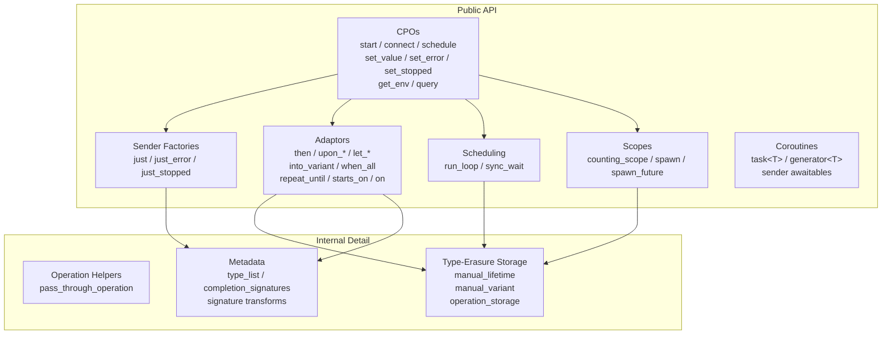
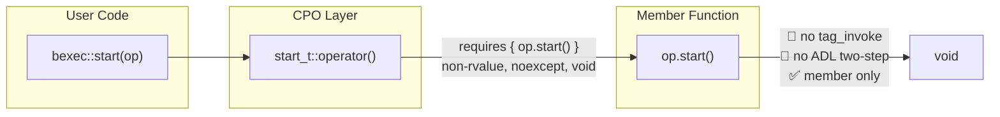
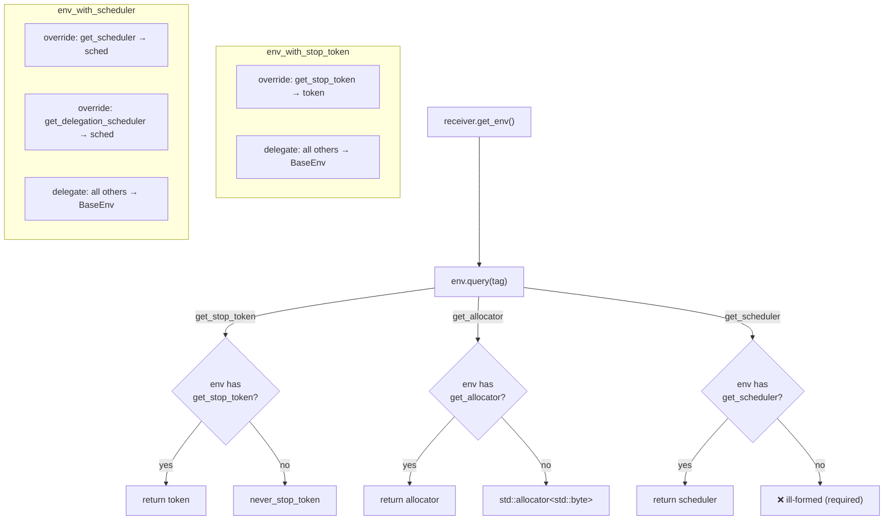
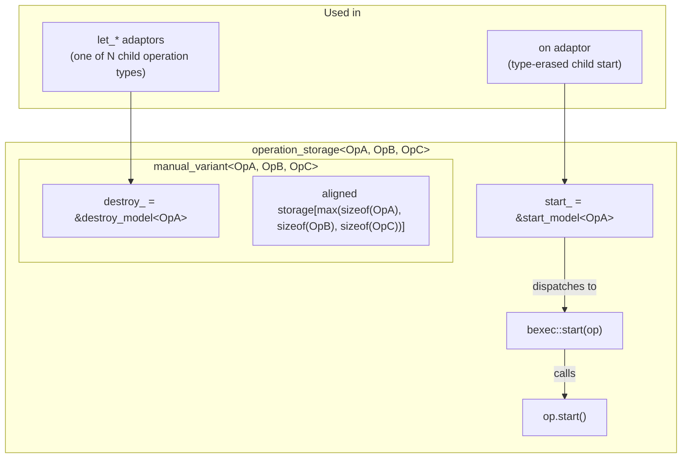
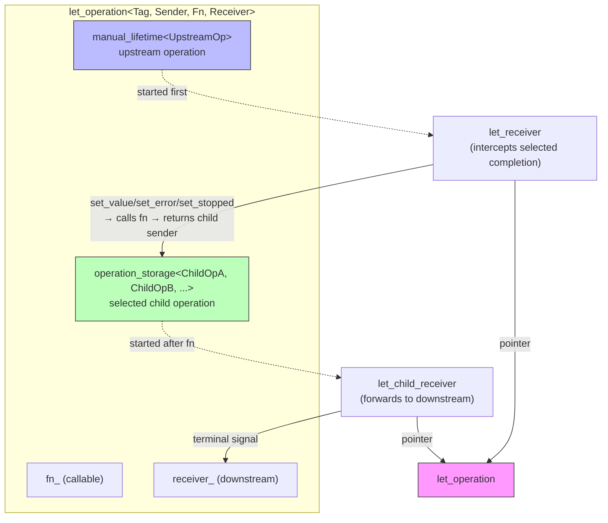
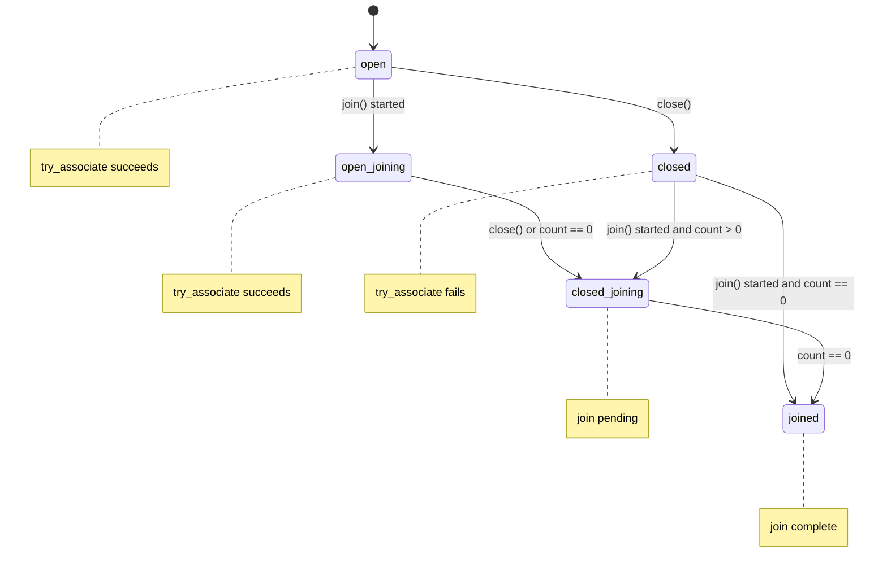

# Design

## Goals

bexec provides a compact C++20 sender/receiver library with production-quality
structure and tests, while avoiding the implementation size and instability of
a full P2300 implementation.

The design favors readable member customization and explicit limitations over
heavy metaprogramming.

### Component Map



## Concepts

The public concepts are intentionally small:

- `operation_state`: `start(op)` is valid.
- `sender`: the type is move-constructible and exposes P2300-style
  `completion_signatures` metadata.
- `sender_to`: `connect(sender, receiver)` returns an operation state.
- `scheduler`: `schedule(scheduler)` returns a sender.
- `stop_token`: supports `stop_requested()` and callback registration.
- `stop_source`: supports `request_stop()`, `stop_requested()`, and
  `get_token()`.

The concepts are compatibility checks for this library, not complete P2300
semantic contracts.

## CPOs And Member Customization

bexec uses CPO-style function objects, but the customization path is explicitly
member-based:

- `start(op)` calls `op.start()` on a non-rvalue operation state. The member
  must be `noexcept` and return `void`.
- `connect(sender, receiver)` calls `sender.connect(receiver)`.
- `schedule(scheduler)` calls `scheduler.schedule()`.
- `set_value(receiver, args...)` calls `receiver.set_value(args...)` on a
  non-const rvalue receiver. The member must be `noexcept` and return `void`.
- `set_error(receiver, error)` and `set_stopped(receiver)` follow the same
  terminal-receiver rule.
- `get_env(receiver)` calls a const `receiver.get_env()` when available.
- `query(env, tag)` invokes the query object, so `query(env, get_stop_token)`
  and `get_stop_token(env)` use the same path. `get_allocator` follows the
  same query path and falls back to `std::allocator<std::byte>`.

There is no `tag_invoke` support. This is intentional. It keeps overload
resolution easy to reason about, keeps diagnostics smaller, and avoids exposing
unstable implementation hooks while the library is still an MVP.

### CPO Dispatch Model



## Completion Metadata

`completion_signatures<Sigs...>` uses P2300-style function types:

```cpp
using completions = bexec::completion_signatures<
    bexec::set_value_t(int),
    bexec::set_error_t(std::exception_ptr),
    bexec::set_stopped_t()>;
```

The public helpers `completion_signatures_of_t`, `value_types_of_t`,
`error_types_of_t`, and `sends_stopped` inspect this signature pack. For example:

```cpp
using sigs = bexec::completion_signatures_of_t<MySender>;
using values = bexec::value_types_of_t<MySender>;
// variant_or_empty<std::tuple<int>, std::tuple<std::string>>

using errors = bexec::error_types_of_t<MySender>;
// variant_or_empty<std::exception_ptr, std::error_code>

constexpr bool can_stop = bexec::sends_stopped<MySender>;
```

The query path is environment-aware: `completion_signatures_of_t<Sender, Env>`
calls a standard-shaped static
`Sender::get_completion_signatures<Sender, Env>()` when present, and otherwise
falls back to the legacy nested `completion_signatures` member.
`sender_to<Sender, Receiver>` checks the sender against the receiver's
environment.

`then`, `upon_error`, and `upon_stopped` transform the selected completion kind
into a value completion and add `std::exception_ptr` to possible errors.
`let_value`, `let_error`, and `let_stopped` replace the selected upstream
completion signatures with the completion signatures of the sender returned by
the user callable, preserve non-selected completions, and add
`std::exception_ptr` for callable/connect exceptions.

`into_variant` maps value signatures to one
`set_value_t(std::variant<std::tuple<...>, ...>)` signature, with duplicate
tuple alternatives removed. Plain `when_all` requires each child sender to have
at most one value completion and declares concatenated successful values plus
raw child error alternatives. `when_all_with_variant` applies `into_variant` to
each child before `when_all`.

## Then/Upon Completion Adaptors

`then`, `upon_error`, and `upon_stopped` follow a simpler pattern than `let_*`:
the selected completion is transformed into a value completion via a callable,
while non-selected completions pass through unchanged.

The `completion_adaptor_sender` (defined in `detail/then.hpp`) wraps the upstream
sender. When connected, it wraps the downstream receiver in a
`completion_adaptor_receiver` that intercepts the selected completion kind:

- `then` intercepts `set_value(args...)`, calls `fn(args...)`, produces
  `set_value(fn_result)` or `set_value()` for void returns.
- `upon_error` intercepts `set_error(error)`, calls `fn(error)`, produces
  `set_value(fn_result)`.
- `upon_stopped` intercepts `set_stopped()`, calls `fn()`, produces
  `set_value(fn_result)`.

Non-selected completions are forwarded directly by the internal receiver without
invoking the callable.

Signature transformation follows a uniform rule: the selected completion
arguments are forwarded to `fn`; the return type becomes
`set_value_t(decay_t<Result>)` (or `set_value_t()` for void return); and
`set_error_t(std::exception_ptr)` is always added to cover callable or connect
exceptions.

The operation state uses `detail::pass_through_operation` to wrap the upstream
operation. This is a lightweight forwarding wrapper: operation storage is
delegated to the upstream sender's own operation state without custom allocation
or type-erased dispatch.

The pipeable `completion_adaptor_closure` follows the same pattern as
`let_closure`. Adaptor closure objects are cheap value types that store the
callable and produce an adaptor sender when applied via `operator|`.

## into_variant Design Rationale

`into_variant` maps multiple `set_value_t(Args...)` alternatives into a single
`set_value_t(std::variant<std::tuple<Args...>, ...>)` signature. This
normalization is required by `when_all_with_variant` so that child senders with
multiple value shapes can participate in structured concurrency without forcing
`when_all` to handle heterogeneous value alternatives per child.

Duplicate tuple alternatives are removed at compile time via the internal
`unique_type_list_t` utility. For example, a sender that can complete as
`set_value_t(int)` or `set_value_t(int)` through two different paths produces
`variant<std::tuple<int>>` rather than `variant<std::tuple<int>,
std::tuple<int>>`.

The implementation is intentionally simple: the `into_variant_receiver` wraps
the downstream receiver, storing the value as a variant in-place. No custom
operation state is required — `into_variant` reuses `pass_through_operation`
because it does not need to store extra child operations or manage queued
callbacks. It only intercepts `set_value` to pack the value into the variant
before forwarding.

`when_all_with_variant` is defined as the composition
`when_all(into_variant(sender)...)`, applying `into_variant` to each child
before constructing the `when_all` sender.

## Ownership Model

Senders are lightweight values. `connect` consumes or copies a sender into an
operation state, depending on value category and copyability.

Receivers are moved into operation states. A receiver must remain valid until it
receives one terminal signal. The library does not retain references to a
receiver after terminal completion except where a user-provided receiver type
itself stores shared state.

Operation states are single-start objects. Starting an operation more than once
is outside the supported contract.

Operation states are not required to be copyable or movable. Implementations
that contain queued callbacks or child receivers pointing into their own state
delete copy and move operations.

For asynchronous senders, the operation state is expected to remain alive until
the terminal signal is delivered. Internal queued callbacks may therefore keep
pointers into their operation state; they must not move receivers into detached
shared ownership to extend lifetime beyond the operation.

## Environment Model

The environment model is deliberately simple. A receiver may provide:

```cpp
auto get_env() const;
```

The returned environment answers queries through member functions:

```cpp
auto query(bexec::get_stop_token_t) const noexcept;
auto query(bexec::get_allocator_t) const noexcept;
auto query(bexec::get_scheduler_t) const noexcept;
auto query(bexec::get_delegation_scheduler_t) const noexcept;
```

If a receiver has no `get_env()`, `empty_env` is used. `empty_env` answers
`get_stop_token` with `never_stop_token` and `get_allocator` with
`std::allocator<std::byte>`.

`env_with_stop_token<BaseEnv>` overrides `get_stop_token` and delegates other
queries to the wrapped environment. `when_all` uses this to give children a
shared cancellation token.

`env_with_scheduler<Scheduler, BaseEnv>` overrides `get_scheduler` and
`get_delegation_scheduler` while delegating other queries. Scheduling adaptors
use scheduler-aware environments so child operations can observe the execution
resource they are running on.

### Query Delegation



## Type-Erasure Strategy

Several operation states need to store one of several possible child operation
types without heap allocation, `std::function`, or `std::optional`. The library
uses three internal detail types for this, all defined in
`include/bexec/detail/` and not part of the public API contract.

**`detail::manual_lifetime<T>`** — Optional-like storage that can construct
non-movable types directly from a factory result. Unlike `std::optional<T>`,
it does not require `T` to be move-constructible. Used when an operation state
stores exactly one child operation whose concrete type is known. An operation
state that conditionally stores a child (e.g., only when a specific completion
kind is selected) uses `manual_lifetime` with `emplace`/`emplace_from` to
deferred-construct the child and `reset()` to destroy it before switching to
a different child.

**`detail::manual_variant<type_list<Alternatives...>>`** — Variant-like storage
where the set of alternatives is fixed at compile time. Each alternative is
constructed directly from a factory via `emplace_from<T>(factory)` without hidden
moves. The active alternative is tracked by a function pointer `destroy_` that
knows how to destroy the stored object. Copy and move are deleted. This is used
when one of several possible types must be stored — for example, the child
operation types implied by the selected upstream completion signatures in
`let_*` and `on`.

**`detail::operation_storage<type_list<Operations...>>`** — Extends
`manual_variant` with type-erased `start()` dispatch. It stores a function
pointer `start_` that dispatches to `bexec::start()` on the active alternative.
Used in `on` to start whichever child operation is currently active without
requiring the caller to know its concrete type. The interface exposes
`emplace_from<T>(factory)` to construct an alternative and wire up the
`start_` pointer, and `start()` to launch the active operation.

These types share a common design rationale:

- **No heap allocation** — storage is a fixed-size aligned buffer shared among
  alternatives (sized to the maximum `sizeof(Alternative)`).
- **No move requirement** — operation states constructed by `emplace_from` are
  never moved, so child operation states can contain internal pointers to
  themselves and delete copy/move operations.
- **Explicit construction** — construction is always explicit through a factory,
  never implicit or copy-based.
- **Not public API** — these are implementation details; the public API surface
  remains sender/receiver concepts and concrete sender/adaptor types.

### Storage Hierarchy



## Stop Token Model

`inplace_stop_source`, `inplace_stop_token`, and `inplace_stop_callback` provide
a small callback-based stop mechanism. Callback records are stored intrusively
inside `inplace_stop_callback`; registration does not allocate and the source
owns only a linked list head plus synchronization state.

The model follows the C++26 `std::inplace_stop_*` lifetime rule:
`inplace_stop_source` is the only owner of the stop state. Associated
`inplace_stop_token` and `inplace_stop_callback` objects do not extend that
state's lifetime, so all uses of those associated objects, including callback
deregistration during `inplace_stop_callback` destruction, must occur before
the associated `inplace_stop_source` is destroyed.

Threading guarantees:

- `request_stop()` is thread-safe.
- `stop_requested()` is thread-safe.
- Callback registration is thread-safe relative to `request_stop()`.
- If stop was already requested, registration invokes the callback immediately.
- Callback invocation is one-shot.
- Destroying a callback registration prevents future invocation if the callback
  has not already been selected for invocation.

Callbacks are expected not to throw. If a callback throws, the implementation
terminates.

## run_loop Model

`run_loop` is a stack-owned FIFO scheduler intended for local execution,
`sync_wait`, and tests. Scheduled operations derive from a small intrusive
operation node. Starting a schedule operation links that operation into the
loop queue; no `std::function` or heap allocation is needed for the scheduling
path.

`run()` blocks until `finish()` is requested and queued work has drained.
`sync_wait` uses a local `run_loop` and a receiver environment that answers both
`get_scheduler` and `get_delegation_scheduler` with that loop's scheduler.

## Scheduling Adaptors And sync_wait

`starts_on(scheduler, sender)` first starts `schedule(scheduler)`. When that
scheduling sender completes successfully, it connects and starts the child
sender. Schedule errors and stopped signals are forwarded to the downstream
receiver.

`on(scheduler, sender)` starts the child through `starts_on`, stores the child
completion in-place, then schedules final delivery through
`get_scheduler(get_env(receiver))`. Connecting an `on` sender is ill-formed
when that scheduler query is unavailable.

`bexec::this_thread::sync_wait(sender)` connects the sender to a receiver backed
by a local `run_loop`. Value completion returns
`std::optional<std::tuple<...>>`, stopped returns `std::nullopt`, and errors are
thrown. `sync_wait_with_variant` applies `into_variant` and returns
`std::optional<std::variant<std::tuple<...>, ...>>`.

## let_* Operation State

`let_value(sender, fn)`, `let_error(sender, fn)`, and
`let_stopped(sender, fn)` are continuation adaptors. They replace only one
upstream completion kind:

- `let_value` calls `fn(args...)` when the upstream sends `set_value(args...)`.
- `let_error` calls `fn(error)` when the upstream sends `set_error(error)`.
- `let_stopped` calls `fn()` when the upstream sends `set_stopped()`.

The callable must return a sender. That child sender is connected to an
internal child receiver and started immediately. The final downstream receiver
gets the child sender's terminal signal. Non-selected upstream completions are
forwarded directly to the downstream receiver without invoking the callable.

The operation state stores:

- the user callable,
- the downstream receiver,
- the upstream operation in `manual_lifetime`,
- storage for one selected child operation.

The child operation storage is a small in-place type switch over the operation
types implied by the selected upstream completion signatures. It does not use
heap allocation, `std::function`, or `std::optional`, and it does not require
child operation states to be movable.

Receivers used by the upstream and child operations store only a pointer back
to the parent operation state. For that reason, the `let_*` operation state
deletes copy and move operations. This follows the library-wide operation
lifetime rule: the operation state must remain alive until the terminal signal
is delivered.

When exceptions are enabled, exceptions thrown while invoking the callable or
connecting the child sender are delivered as `set_error(std::exception_ptr)`.
With exceptions disabled, throwing callables are not supported.

### `let_*` Operation State Layout



## repeat_until State Machine

`repeat_until(factory, predicate)` uses a sender-producing factory. Each
iteration creates a fresh sender and connects it to an internal receiver.

This avoids restarting the same operation state, which would be invalid for
many senders.

The implementation handles synchronous and asynchronous completion with an epoch
counter:

- Before starting a child operation, the drain loop records the current epoch.
- The child receiver stores the child completion, including value arguments, in
  operation-owned storage.
- The child receiver and the drain loop race to advance the epoch after
  completion or `start()` return.
- The thread whose compare-exchange fails processes the stored completion: it
  runs the predicate, completes the receiver, or starts the next iteration.
- If the child completed before `start()` returned, the drain loop processes the
  stored completion and can continue directly.
- If `start()` returned before the child completed, the later asynchronous
  callback processes the stored completion and re-enters the drain loop when the
  predicate asks for another iteration.

Child values from the most recent successful iteration are forwarded when the
predicate returns true. Errors and stopped signals are propagated.
Cancellation is checked through the receiver environment before each iteration.

## when_all Operation State

`when_all` stores operation-owned state containing:

- the final receiver,
- a remaining-child count,
- a mutex,
- an internal `inplace_stop_source`,
- the first terminal error/stopped state,
- an optional error `std::variant`,
- in-place optional storage for each child value tuple.

The state is a direct member of the operation state. Child receivers store a
pointer to it; they do not share-own it. This relies on the P2300 operation
lifetime rule that the operation state remains alive until completion.

All child operations are started. On the first error or stopped signal,
`when_all` records that terminal state and requests stop through the shared stop
source. A downstream stop request is also registered with the internal stop
source before children are started, so children receive cancellation through
their environment even when the final receiver's stop token is requested.

The final receiver is completed only after all started children have finished.
If the first terminal state was an error, the receiver gets the stored error as
its original error type. If it was stopped, the receiver gets `set_stopped()`.
If all children succeed, the stored value tuples are concatenated and delivered
as `set_value(args...)` in child order.

The internal error storage remains a `std::variant` so the operation can keep
the first error until all children finish. That variant is not the public error
completion shape. The downstream stop callback registration is stored in-place
with its concrete callback type; the `when_all` operation does not allocate for
cancellation propagation.

## Counting Scopes And Spawn

`simple_counting_scope` and `counting_scope` maintain an association count and
a small state machine. `close()` prevents new associations, and `join()`
completes after the count reaches zero. Starting a join does not immediately
close a non-empty open scope; associations are still allowed while the scope is
open and joining.
`counting_scope` additionally owns an `inplace_stop_source`; its token wraps
child senders so scope stop requests are visible through `get_stop_token`.

The simple scope state is monotonic; `unused` is tracked as a separate flag
instead of as a state value. `try_associate()` accepts only `open` and
`open_joining`, which lets the implementation test association eligibility by
state ordering. Open states never jump directly to `joined`: they first move to
`closed_joining`, which prevents successful new associations, and only then
recheck the count before completing the join. A closed scope whose count is
already zero may move directly to `joined` because no new count can be added.



Scope destruction is intentionally strict and follows the C++26
`simple_counting_scope` / `counting_scope` contract. After a scope has accepted
work, callers must call `close()` and wait for a started `join()` sender to
complete before destruction. Destruction is valid only for an `unused`,
`unused-and-closed`, or `joined` scope; the standard contract requires
`std::terminate()` for every other state. Tokens and associations are
non-owning, so they must not be retained or used after the scope is destroyed.

bexec enforces this invariant with `std::terminate()` in every build
configuration. This is a fail-fast lifetime boundary, not an alternative scope
policy.

`spawn(sender, token, env)` is the detached form. It obtains an association,
allocates an operation through `get_allocator(env)`, wraps the input sender
with the token, and eagerly starts it. The detached receiver accepts only
`set_value()` and `set_stopped()`; either terminal signal destroys the child
operation and releases the association.

`spawn_future(sender, token, env)` follows the C++ standard wording shape. It
first constructs the wrapped child operation, then attempts to associate with
the scope. If association fails, the child is not started and the future state
stores `set_stopped()`. If association succeeds, the child is eagerly started
and its terminal signal is stored in a `std::variant` of decayed completion
tuples.

The returned future sender is move-only and one-shot. Its heap state supports
three serialized operations:

- `complete`: records that the child finished and delivers to a registered
  consumer, if any.
- `consume`: registers the future receiver, or immediately delivers an already
  stored result.
- `abandon`: requests stop through the future state's internal stop source if
  the child has not completed; otherwise it destroys the state.

Abandoning the future does not complete the future receiver with stopped. It
only requests stop for the child. The scope association remains held until the
child sends its terminal signal and the future state is destroyed.

State destruction deliberately moves the association out before destroying and
deallocating the state, so the association is released only after allocator
storage is no longer used.

## Coroutine Design

`as_awaitable(value, promise)` preserves native awaitables and converts
single-value senders into `sender_awaitable<Sender, Promise>`.
`with_awaitable_senders<Promise>` supplies the promise `await_transform`,
continuation storage, and stopped propagation hook.

The continuation API is intentionally the one specified by
[P2300R10's `execution::with_awaitable_senders`](https://www.open-std.org/jtc1/sc22/wg21/docs/papers/2024/p2300r10.html#exec.with.awaitable.senders);
it is not extra state introduced solely for `bexec::task`.
`set_continuation` records both the caller handle and a type-erased function
that invokes the caller promise's `unhandled_stopped`.
Consequently, a stopped sender transfers directly through the coroutine call
chain without resuming coroutine bodies or becoming catchable by
`catch (...)`. `task` adds only its root policy: recording a stopped result when
there is no calling coroutine. For a non-task promise with no caller-side
stopped handler, bexec uses its project-wide assert/unreachable failure
convention where P2300 specifies termination.

The awaitable receiver stores one pointer back to its owning awaitable. The
awaiter stores the result slot, error, continuation, promise pointer, and child
operation. The operation is initialized directly from
`connect(sender, receiver{*this})`, which supports non-movable operation states
without `manual_lifetime` or a separate allocation. Guaranteed copy elision
constructs the non-movable awaitable directly in the coroutine frame.

Successful sender completion supports no value, `set_value()`, or one
`set_value(T)`. Multiple value alternatives and multi-argument value
completions are rejected. Error values are converted to `exception_ptr`;
stopped completion invokes `promise.unhandled_stopped()` and transfers to the
stored continuation.

`task<T>` remains lazy and retains `start()`, `done()`, and `result()`. Its
promise inherits the sender-awaiting mixin, and rvalue tasks can be awaited by
other tasks through symmetric continuation transfer. A task waiting for an
asynchronous operation must remain alive and must not be manually resumed.
Cancellation-owned lifetime is intentionally not implemented.

`generator<T>` is a separate synchronous coroutine type. It is a move-only,
single-pass input range using `default_sentinel_t`; each `co_yield` stores one
`T` in the promise. It deliberately rejects `co_await`, avoiding an asynchronous
readiness state that a normal input iterator cannot represent.

No operation-specific allocation is performed by these helpers. Coroutine
frame allocation remains controlled by the compiler and coroutine ABI.
