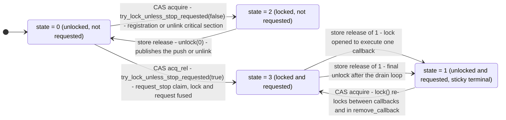
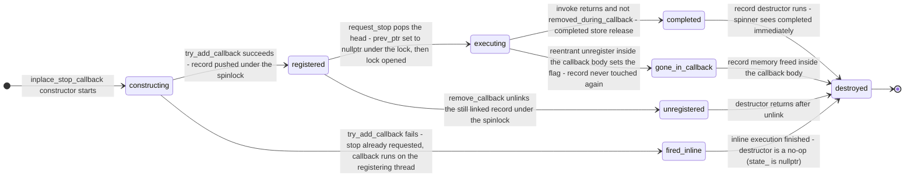

# Stop Token Model

`inplace_stop_source`, `inplace_stop_token`, and `inplace_stop_callback` provide
a small callback-based stop mechanism. Callback records are stored intrusively
inside `inplace_stop_callback`; registration does not allocate and the source
owns only a linked list head plus a single fused state word.

The model follows the C++26 `std::inplace_stop_*` lifetime rule:
`inplace_stop_source` is the only owner of the stop state. Associated
`inplace_stop_token` and `inplace_stop_callback` objects do not extend that
state's lifetime, so all uses of those associated objects, including callback
deregistration during `inplace_stop_callback` destruction, must occur before
the associated `inplace_stop_source` is destroyed.

Threading guarantees:

- `request_stop()` is thread-safe.
- `stop_requested()` is thread-safe and lock-free (a single acquire load).
- Callback registration is thread-safe relative to `request_stop()`.
- If stop was already requested, registration invokes the callback immediately,
  on the registering thread.
- Callback invocation is one-shot.
- Destroying a callback registration prevents future invocation if the callback
  has not already been selected for invocation.

Callbacks are expected not to throw. Every invocation path is `noexcept`; if a
callback throws, the implementation terminates.

## Why remove the mutex

The previous design guarded the callback list with a `std::mutex`. On the
physical-machine benchmark (`.artifacts/REPORT.md` §7.2/§8.5, i9-13900H,
GCC 16.2.1, `-O3`), the *uncontended* mutex fast path alone consumes 39–43% of
iteration time in the stop-token cases:

| Case                        | Mutex lock calls / iter | Lock share of iteration |
|-----------------------------|-------------------------|-------------------------|
| `stop_token.request`        | 2                       | 43%                     |
| `stop_token.callback_raii`  | 3                       | 42%                     |
| `stop_token.callback_fired` | 5                       | 41%                     |
| `stop_token.callback_fired_8` | 26                    | 39%                     |

A calibrated uncontended `pthread_mutex_lock+unlock` pair costs 2.32 ns
(`tools/mutex_calib.c`), while stdexec's equivalent protocol uses zero mutexes
(zero `pthread_mutex` calls across all 54 benchmark case pairs). Removing the
mutex also removes the registration-path lock traffic seen in
`when_all.just_1` (~25% of iteration time), which registers one stop callback
per child.

Goal: no mutex anywhere on the stop-token path. The hot read
`stop_requested()` stays lock-free. Registration and unregistration remain
blocking operations, but they block on a spinlock fused into the same atomic
word as the stop flag — never on a futex.

## Public API (unchanged)

Class names, signatures, and contracts do not change; only the internal
representation and algorithms do.

- `never_stop_token` — untouched.
- `inplace_stop_source` — default constructor, non-copyable, destructor,
  `get_token()` (const and non-const), `stop_requested() const noexcept`,
  `request_stop() noexcept -> bool`.
- `inplace_stop_token` — default constructor, copyable, `callback_type` alias,
  `stop_requested() const noexcept`.
- `inplace_stop_callback<Callback>` — constructor
  `(const inplace_stop_token&, Callback)`, non-copyable, non-movable,
  destructor unregisters.
- The `stop_token` / `stop_source` concepts — untouched.

`request_stop()` return contract: **returns `true` if and only if this call
performed the stop request** (i.e., won the claim); every other call returns
`false`. This matches the current bexec behavior and
`[stopsource.inplace]` — see deviation D1 below, because the reference
snapshot inverts this.

## Data layout

```cpp
namespace detail {

struct stop_state;

struct stop_callback_record {
  // List linkage: plain fields, guarded by the stop-state spinlock.
  stop_callback_record*  next     = nullptr;
  stop_callback_record** prev_ptr = nullptr;  // address of the slot pointing at this record

  // Execution handshake.
  bool*             removed_during_callback = nullptr;  // flag owned by the notifying thread
  std::atomic<bool> completed{false};                   // cross-thread completion signal

  // Dispatch.
  void (*invoke)(stop_callback_record*) noexcept = nullptr;
};

struct stop_state {
  static constexpr uint8_t stop_requested_bit = 1;  // bit 0
  static constexpr uint8_t locked_bit         = 2;  // bit 1

  mutable std::atomic<uint8_t> state{0};  // stop flag and spinlock fused into one word
  stop_callback_record* head   = nullptr; // plain pointer, guarded by the spinlock
  std::thread::id requester_thread{};     // written under the lock by request_stop()
};

}  // namespace detail
```

The `inplace_stop_callback` object keeps its existing members: the decayed
`callback_`, an `owned_record` (a `stop_callback_record` plus a
`void* owner` back-pointer used by `invoke_record`), and
`detail::stop_state* state_` — set to the token's state on successful
registration, `nullptr` otherwise. `state_ != nullptr` is exactly "the
destructor must call `remove_callback`".

### The `prev_ptr` pointer-to-pointer trick

The old design stored a raw `prev` node pointer and needed a special case in
`unlink()` (`if (prev == nullptr) head = next`). The new design stores the
*address of the slot that points at this record*:

- head record: `prev_ptr == &stop_state::head`
- otherwise:   `prev_ptr == &predecessor->next`

Unlinking becomes uniform — `*prev_ptr = next` plus fixing the successor's
`prev_ptr` — with no head special case. Additionally, `prev_ptr == nullptr`
doubles as the "no longer in the list" marker: it is set to `nullptr` when
`request_stop()` pops the record and when `~inplace_stop_source()` drains it.
A `remove_callback()` that observes `prev_ptr == nullptr` knows the record is
out of the list and takes the completion-handshake path instead.

Fields dropped relative to the old record: `std::atomic<stop_state*> state`
(registration marker — superseded by `prev_ptr`), `std::atomic_bool executing`
(superseded by `completed`), `bool* destroyed` (renamed
`removed_during_callback`, role refined). The `std::mutex`, the separate
`std::atomic_bool requested`, and the `push`/`unlink` helpers are gone.

## The stop-state word

One `std::atomic<uint8_t>` holds both the stop flag and the spinlock:

| Value | Meaning |
|-------|---------|
| 0     | unlocked, stop not requested (idle) |
| 1     | unlocked, stop requested (callback-execution window; terminal value) |
| 2     | locked, stop not requested (registration/unlink critical section) |
| 3     | locked, stop requested (post-claim state; re-lock between callbacks) |

The requested bit is sticky: 1 is never left once entered. The lock is held
only for O(1) list surgery (push, unlink, pop — a handful of pointer writes);
callbacks execute with the lock *open*.



Which transitions are CAS vs plain store:

- `0 → 2` and `0 → 3`: compare-exchange (the only CAS sites). A CAS from 0 is
  the *only* way to acquire the lock; a CAS-free path exists for no one.
- `1 → 3`: compare-exchange (acquire) — `lock()` re-acquiring after a callback
  or during `remove_callback`.
- `2 → 0`, `3 → 1`: plain release stores. The lock holder is the only writer
  while the lock bit is set, so it may restore/overwrite the word directly.
- `unlock(prev)` restores the *pre-lock value* captured by `lock()`: this
  keeps the requested bit iff it was already set (e.g., unlinking another
  record from inside the execution window restores 1, not 0). `request_stop()`
  never uses `unlock(prev)` after the claim — it explicitly stores the
  constant `1`, because its pre-lock value (0) lacks the requested bit.

There is no ABA hazard: the word carries only flag bits, and the list is
manipulated exclusively under the spinlock with plain pointer writes.

## Callback record lifecycle



Invariants that make the protocol sound:

- I1. A record is in the list if and only if `prev_ptr != nullptr`. Once popped
  or drained it is never re-linked.
- I2. After `request_stop()` returns, every popped record that is still alive
  has `removed_during_callback == nullptr` and `completed == true`.
- I3. The `removed_during_callback` *pointer field* is written and read only by
  the notifying thread; the *pointee bool* is written only by a reentrant
  unregister running on that same thread (inside the callback body). No
  cross-thread access to either ever occurs.
- I4. All other plain fields (`head`, `next`, `prev_ptr`, `requester_thread`)
  are accessed only while holding the spinlock.
- I5. `invoke` is fixed at construction, before the record is published
  (publication happens via the release unlock or the inline call, both on the
  constructing thread).

## Algorithms

Pseudocode for the whole protocol. Names follow bexec snake_case; adjust to
house style. `spin_wait` is defined in the Spinning policy section.

### lock / unlock

```cpp
// Returns the pre-lock state value; the caller MUST pass it to unlock().
uint8_t lock() noexcept {
  spin_wait s;
  uint8_t prev = state.load(std::memory_order_relaxed);
  for (;;) {
    while ((prev & locked_bit) != 0) {          // held: spin without CAS
      s.wait();
      prev = state.load(std::memory_order_relaxed);
    }
    // CAS from {0, 1} to {2, 3}. Acquire pairs with the previous unlock.
    if (state.compare_exchange_weak(prev, prev | locked_bit,
                                    std::memory_order_acquire,
                                    std::memory_order_relaxed)) {
      return prev;
    }
  }
}

void unlock(uint8_t prev) noexcept {
  // Restore the pre-lock value: keeps the requested bit iff it was set.
  state.store(prev, std::memory_order_release);
}
```

### try_lock_unless_stop_requested

```cpp
// Returns true iff the lock was acquired. With set_requested == true the stop
// request is claimed in the same RMW. On success with set_requested == false
// the caller must unlock(0).
bool try_lock_unless_stop_requested(bool set_requested) noexcept {
  spin_wait s;
  uint8_t prev = state.load(std::memory_order_relaxed);
  for (;;) {
    if ((prev & stop_requested_bit) != 0) {
      return false;                    // stop already requested: fail fast, no CAS
    }
    if (prev != 0) {                   // == locked_bit: held, spin
      s.wait();
      prev = state.load(std::memory_order_relaxed);
      continue;
    }
    // Only ever CASes from 0. The claim fuses lock + request into one RMW.
    uint8_t next = set_requested ? (locked_bit | stop_requested_bit) : locked_bit;
    if (state.compare_exchange_weak(prev, next,
                                    std::memory_order_acq_rel,
                                    std::memory_order_relaxed)) {
      return true;
    }
  }
}
```

### Registration (`inplace_stop_callback` constructor)

```cpp
record_.owner  = this;
record_.invoke = &invoke_record;
stop_state* s = token.state_;
if (s == nullptr) {
  return;                              // null token: never fires
}
if (s->try_add_callback(&record_)) {
  state_ = s;                          // registered
  return;
}
// Stop already requested: fire inline, never enters the list.
state_ = nullptr;                      // destructor becomes a no-op
record_.invoke(&record_);
```

```cpp
bool try_add_callback(stop_callback_record* r) noexcept {
  if (!try_lock_unless_stop_requested(false)) {
    return false;                      // caller fires the callback inline
  }
  // Plain writes under the spinlock. Push onto the head.
  r->next     = head;
  r->prev_ptr = &head;                 // slot that will hold r
  if (r->next != nullptr) {
    r->next->prev_ptr = &r->next;      // former head now hangs off r->next
  }
  head = r;
  unlock(0);                           // release-publishes the push
  return true;
}
```

### request_stop

```cpp
bool request_stop() noexcept {
  if (!state_.try_lock_unless_stop_requested(true)) {
    return false;                      // already requested (contract: loser returns false)
  }
  // This thread holds the lock and the requested bit is set (state == 3).
  state_.requester_thread = std::this_thread::get_id();  // plain, under lock

  while (state_.head != nullptr) {
    stop_callback_record* r = state_.head;
    r->prev_ptr = nullptr;             // "popped" marker, under lock
    state_.head = r->next;
    if (state_.head != nullptr) {
      state_.head->prev_ptr = &state_.head;
    }
    bool removed_during_callback = false;
    r->removed_during_callback = &removed_during_callback;  // under lock (D3)

    // ONE store: opens the lock AND keeps the requested flag visible.
    state_.state.store(stop_requested_bit, std::memory_order_release);

    r->invoke(r);                      // callback runs with the lock OPEN

    if (!removed_during_callback) {
      // r is still valid: finalize it so unregisterers stop waiting.
      r->removed_during_callback = nullptr;
      r->completed.store(true, std::memory_order_release);
    }
    // If removed_during_callback is true, r was destroyed inside its own
    // callback body; r is dangling and must not be touched (scenario 3).

    state_.lock();                     // re-lock: CAS acquire {1} -> {3}
  }

  state_.state.store(stop_requested_bit, std::memory_order_release);  // final unlock
  return true;
}
```

### remove_callback (unregistration, called by the destructor)

```cpp
void remove_callback(stop_callback_record* r) noexcept {
  uint8_t prev = lock();               // CAS acquire
  if (r->prev_ptr != nullptr) {
    // Still linked: uniform unlink, no head special case.
    *r->prev_ptr = r->next;
    if (r->next != nullptr) {
      r->next->prev_ptr = r->prev_ptr;
    }
    unlock(prev);
    return;
  }
  // Popped (or drained by ~inplace_stop_source): out of the list.
  std::thread::id notifier = requester_thread;   // plain read under lock
  unlock(prev);

  if (std::this_thread::get_id() == notifier) {
    // Reentrant destroy on the requesting thread (scenario 3), or the
    // requesting thread destroying a record that already completed
    // (scenario 5): the nullptr guard skips finished request_stop calls.
    if (r->removed_during_callback != nullptr) {
      *r->removed_during_callback = true;
    }
  } else {
    // Executing (or about to execute) on the requesting thread: wait.
    spin_wait s;
    while (!r->completed.load(std::memory_order_acquire)) {
      s.wait();
    }
  }
}

~inplace_stop_callback() {
  if (state_ != nullptr) {
    state_->remove_callback(&record_);
  }
}
```

### ~inplace_stop_source (defensive drain)

```cpp
~inplace_stop_source() {
  uint8_t prev = state_.lock();
  while (state_.head != nullptr) {
    stop_callback_record* r = state_.head;
    state_.head = r->next;
    if (state_.head != nullptr) {
      state_.head->prev_ptr = &state_.head;
    }
    r->prev_ptr = nullptr;             // mark removed
    r->next     = nullptr;
    // Unblock any future unregister: a drained record can never be
    // executed, so a spinner would otherwise wait forever.
    r->completed.store(true, std::memory_order_release);
  }
  state_.unlock(prev);
}
```

The drain does **not** invoke callbacks (same as the old design and stdexec).
It preserves bexec's defensive behavior for registrations that were never
destroyed before the source died. Safety invariants:

- Any record still linked at destruction time was registered before any stop
  request — a post-request registration fires inline and never enters the
  list — hence `requester_thread` is still the default-constructed
  `std::thread::id`, which compares unequal to every live thread id. A later
  `remove_callback` on a drained record therefore takes the spinner branch and
  exits immediately on the pre-set `completed`.
- Unregistration concurrent with the drain serializes on the spinlock: whoever
  unlinks first wins; the loser observes `prev_ptr == nullptr` and the
  pre-set `completed` and returns immediately.
- Registration concurrent with `~inplace_stop_source` is excluded by the
  documented lifetime contract (the source must outlive the registration);
  it would push into a dying list, exactly as with the old mutex design.
- Unlike the old mutex-based destructor, the drain does **not** make a
  concurrent in-flight `request_stop()` on another thread safe: the notifying
  thread re-locks between callbacks and could touch the state word after the
  destructor returned. The old mutex happened to tolerate this; the public
  contract never promised it. See deviation D2.

## Interleaving scenarios

Every race the protocol must survive. In the tables, "state" is the value of
the stop-state word after the step.

### Scenario 1 — registration races the request_stop claim

Both threads start with `state == 0`. Thread A registers record R; thread B
calls `request_stop()`.

| Step | Thread A (register R)                        | Thread B (request_stop)                          | State |
|------|----------------------------------------------|--------------------------------------------------|-------|
| 1    | load state → 0                               |                                                  | 0     |
| 2    |                                              | load state → 0                                   | 0     |
| 3    | CAS 0→2 (acquire) wins, holds lock           |                                                  | 2     |
| 4    | push R (plain writes to head/next/prev_ptr)  |                                                  | 2     |
| 5    | unlock(0): release store — publishes the push|                                                  | 0     |
| 6    |                                              | CAS 0→3 (acq_rel) wins; acquire sees A's list with R | 3 |
| 7    |                                              | drain loop pops R and invokes it                 | 3↔1   |

Reversed winner:

| Step | Thread A (register R)                                   | Thread B (request_stop)        | State |
|------|----------------------------------------------------------|--------------------------------|-------|
| 1    |                                                          | CAS 0→3 (acq_rel) claim wins   | 3     |
| 2    | load/CAS attempt observes the requested bit              |                                | 3     |
| 3    | `try_lock_unless_stop_requested` returns false           | pops and invokes existing list | 3↔1   |
| 4    | `state_ = nullptr`; R fired inline on thread A           |                                | 1     |

Why the shared lock bit closes the Treiber-stack hole: with a naive design
(atomic flag + lock-free Treiber push via CAS on head), B could set the flag,
read `head == nullptr`, and declare the drain finished — while A's push lands
after B's read. R would never be invoked and would dangle in the list of a
source that may then be destroyed. Here a push requires winning the CAS
`0 → 2` from state 0; after B's claim the state is 1 or 3 forever, so no push
can complete after the claim, and any push completed before the claim is
visible to B's acquire. Registration linearizes either strictly before the
claim (record is drained) or strictly after it (inline fire). There is no
third interleaving.

### Scenario 2 — registration observes stop already requested

`state ∈ {1, 3}`. Thread A registers R.

1. A: `try_lock_unless_stop_requested(false)` sees the requested bit (state 1
   directly, or after spinning while 3) → returns false, no CAS performed.
2. A: `state_ = nullptr` — the record never enters a list; the destructor will
   be a no-op.
3. A: invokes R inline, on the registering thread.

No list mutation happens. Nested cases inside the inline call are allowed and
recurse by the same rules: R may register further callbacks on the same source
(each fires inline), call `request_stop()` (returns false), or unregister
other records (lock, unlink, unlock — normal path).

### Scenario 3 — reentrant destroy inside the callback body (same thread as request_stop)

Single thread T runs `request_stop()`; the callback body destroys its own
`inplace_stop_callback` object (e.g., a scoped guard).

| Step | Thread T                                                                          | State |
|------|------------------------------------------------------------------------------------|-------|
| 1    | CAS 0→3 claim wins; `requester_thread = T` (under lock)                            | 3     |
| 2    | pop R: `R.prev_ptr = nullptr`, head advanced (under lock)                          | 3     |
| 3    | `R.removed_during_callback = &flag` (under lock)                                   | 3     |
| 4    | store 1 (release): lock open                                                       | 1     |
| 5    | invoke R → body destroys the object → `remove_callback(R)`: CAS 1→3, sees `prev_ptr == nullptr`, reads `requester_thread == T == self`, unlock(1), `*flag = true`, record memory freed | 1↔3↔1 |
| 6    | invoke returns; reads local `flag == true` → skips both `R.removed_during_callback = nullptr` and `R.completed.store(...)` | 1 |
| 7    | `lock()` re-acquires (1→3); loop continues with the next head                      | 3     |

Without the step-6 guard, T would write `completed` into freed memory. The
pointer read in step 5 is race-free by invariant I3: only T ever touches that
field and the pointee, and everything here is T's own sequential execution.

### Scenario 4 — unregister races execution cross-thread

Thread T runs `request_stop()` and is executing R (`state == 1`,
`R.prev_ptr == nullptr`, `completed == false`). Thread U destroys the
callback object.

| Step | Thread T                                                  | Thread U                                                    | State |
|------|-----------------------------------------------------------|-------------------------------------------------------------|-------|
| 1    | (executing R, lock open)                                   | `remove_callback(R)`: spins while 3, then CAS 1→3 (acquire) | 3     |
| 2    |                                                            | `R.prev_ptr == nullptr` → popped path; reads `requester_thread == T` under lock | 3 |
| 3    |                                                            | unlock(1) — restore-form unlock keeps the requested bit     | 1     |
| 4    |                                                            | spins on `R.completed.load(acquire)` (pause / yield)        | 1     |
| 5    | invoke returns; `flag == false`; `R.removed_during_callback = nullptr`; `R.completed.store(true, release)` — lock still open | | 1 |
| 6    | `lock()` re-acquires; continues with the next record        | load observes `true` → record quiescent → U destroys it     | 1↔3   |

T never touches R after the `completed` store, so U's destruction cannot race
any access. U's spin is bounded by the callback body's duration.

### Scenario 5 — unregister after completion

R was already executed to completion (`completed == true`, invariant I2).
Thread U destroys the callback:

1. U: `lock()` (CAS acquire).
2. U: `R.prev_ptr == nullptr` → popped path; reads `requester_thread` under
   lock; unlock.
3. U: if `requester_thread != U`: spins on `completed` — exits on the first
   load. If `requester_thread == U` (U itself requested stop earlier): the
   `removed_during_callback != nullptr` guard sees `nullptr` (I2) and skips —
   this guard is what prevents dereferencing the dead stack flag of a finished
   `request_stop()` call.
4. U: destroys the record. No list access ever happens.

### Scenario 6 — two concurrent request_stop calls

Thread T1 and thread T2 call `request_stop()` concurrently with `state == 0`.

- Exactly one of them wins the claim CAS `0 → 3` and returns **true**.
- The loser's `try_lock_unless_stop_requested(true)` observes the requested
  bit — immediately if it loads 3, or after spinning while 3 and then seeing
  1 or 3 during T1's execution window — and returns false without ever taking
  the lock. `request_stop()` returns **false**.
- The loser does not wait for T1's callbacks and does not touch the list.

Contract (deviation D1): the call that performs the claim returns true; every
other call returns false, matching current bexec behavior and
`[stopsource.inplace]`.

### Scenario 7 — ~inplace_stop_source drain vs in-flight operations

Thread B destroys the source while thread A performs stop-token operations.

- **A registers (completed before B's lock):** the record is in the list; B's
  drain unlinks it and pre-sets `completed = true`. A's later
  `remove_callback` takes the popped path with the default
  `requester_thread`, spins once, observes `true`, returns. Safe.
- **A unregisters while B drains:** serialized by the spinlock. If A's
  `lock()` wins first, it unlinks normally and the drain finds one record
  less. If B wins, A observes `prev_ptr == nullptr` and the pre-set
  `completed` and returns immediately. Safe both ways.
- **A registers while B drains:** excluded by the lifetime contract
  (registration concurrent with source destruction is misuse). If it happened,
  A could push after the drain finished — the same exposure the old mutex
  design had.
- **A runs request_stop while B drains:** the drain no longer makes this safe
  (see D2). A is in its open-lock execution window while B drains the rest;
  after B returns, A's re-lock touches the state word of a source whose
  destructor has run. The old mutex design happened to serialize this; the
  public contract does not require it. Same behavior as stdexec.

### Scenario 8 — the open-lock execution window (state == 1)

While R executes, the spinlock is open but the requested bit is set.
Concurrent operations and their behavior:

| Concurrent operation                        | Behavior during the window                                   |
|---------------------------------------------|--------------------------------------------------------------|
| register a new record                       | sees the requested bit → inline fire on the registering thread (no list mutation) |
| unregister another still-linked record      | lock (CAS 1→3), unlink, unlock restores 1 — runs concurrently with the callback |
| unregister R itself, same thread (inside R) | scenario 3: `removed_during_callback` flag path              |
| unregister R, cross-thread                  | scenario 4: spin on `completed`                              |
| `request_stop()` from any thread            | returns false immediately (requested bit observed; no lock needed) |
| `stop_requested()` from any thread          | true, single acquire load, wait-free                         |

Forbidden during the window: destroying the source (lifetime contract), and
any access to R's record from other threads other than the `completed` spin.

Execution with the lock open is what makes the protocol deadlock-free and
fast: a callback that registers or unregisters callbacks on the same source
does not self-deadlock on the spinlock, and a long callback does not block
manipulation of *other* records for its whole duration.

## Memory-ordering reference

Atomic operations on the stop-state word:

| Site | Operation | Order | Justification |
|------|-----------|-------|---------------|
| spin loops in `lock()` / `try_lock_unless_stop_requested()` | `state.load` | relaxed | Only feeds the CAS expected value; all visibility is carried by the CAS. |
| `lock()` success | `compare_exchange_weak(prev, prev\|locked)` | acquire (fail: relaxed) | Acquire pairs with the previous release unlock/flag store, publishing list and record writes from prior critical sections. |
| `try_lock_unless_stop_requested()` success | `compare_exchange_weak(0, 2 or 3)` | acq_rel (fail: relaxed) | Acquire as above; the release side makes the claim's requested bit a release-store for hot readers. |
| `unlock(prev)` | `state.store(prev)` | release | Publishes the critical section's list surgery and record-field writes to the next acquirer. |
| `request_stop()`: open window | `state.store(1)` | release | Doubles as the unlock and as the release that hot readers synchronize with; publishes `requester_thread` and the record field writes. |
| `request_stop()`: final | `state.store(1)` | release | Same; the requested bit is sticky. |
| `stop_requested()` (source and token) | `state.load` | acquire | A true result synchronizes with the release store above, so the reader also sees all writes sequenced before `request_stop()`. |
| after invoke | `completed.store(true)` | release | Publishes "this record will not be touched again" to unregistering threads. |
| unregister spinner | `completed.load` | acquire | After observing true, the record is quiescent; destroying it cannot race the notifier. |

Plain (non-atomic) fields and their guards:

| Field | Guard |
|-------|-------|
| `head`, `next`, `prev_ptr`, `requester_thread` | spinlock, always (invariant I4) |
| `removed_during_callback` (field and pointee) | notifying thread only, by control-flow confinement (invariant I3) |
| `invoke`, `owner` | fixed at construction, before publication (invariant I5) |
| `callback_` | constructed before registration; read by whichever thread executes — ordered by the registration publish or by inline sequencing |

## Spinning policy

All waiting in the protocol uses one primitive:

```cpp
struct spin_wait {
  static constexpr uint32_t yield_threshold = 20;
  uint32_t count = 0;
  void wait() noexcept {
    if (count++ < yield_threshold) {
      cpu_pause();                    // x86/x86-64: asm "pause" or _mm_pause
                                      // ARM/AArch64: asm "yield"
                                      // PPC64: asm "or 27,27,27"
    } else {
      std::this_thread::yield();
    }
  }
};
```

- After 20 pauses the thread yields to the scheduler; the counter may simply
  stay above the threshold thereafter (stdexec additionally guards against
  uint32 wraparound — optional here).
- **Never**: futex, any direct syscall, `std::atomic<T>::wait/notify`,
  condition variables, or `std::mutex`. The old design's
  `executing.wait()` is replaced by the `completed` spin.
- Every potentially-unbounded wait uses `spin_wait`: the two lock loops and
  the `completed` spinner in `remove_callback`.
- Rationale: critical sections are O(1) pointer writes, and callbacks execute
  with the lock open, so a lock hold is always a few instructions; pausing is
  cheaper than any syscall. The yield threshold keeps pathological
  oversubscription from starving a lock holder.

## Progress guarantees

- `stop_requested()`: wait-free (one acquire load).
- Lock acquisition, registration, unregistration: blocking (bounded spin),
  not lock-free. Lock hold times are O(1) by construction.
- `request_stop()`: blocking until the claim; executes each callback exactly
  once, with the lock open, on the claiming thread.
- A callback that never returns blocks a cross-thread unregisterer of that
  record forever (the `completed` spin). This is inherent to the one-shot
  callback contract and identical to stdexec and `std::inplace_stop_*`.

## Attribution

The protocol is adapted from stdexec (tag nvhpc-26.05), file
`include/stdexec/stop_token.hpp`, Copyright (c) 2021-2022 Facebook, Inc.;
2021-2024 NVIDIA Corporation, licensed under Apache License v2.0 with LLVM
Exceptions. bexec is MIT-licensed; this document references the algorithm and
its rationale — the bexec implementation is written from this specification,
not copied from stdexec source.

Mechanism map into the reference file:

| Mechanism | stdexec `stop_token.hpp` lines |
|-----------|-------------------------------|
| flag constants (`__stop_requested_flag_` = 1, `__locked_flag_` = 2) | 145–146 |
| state word / list head / notifying-thread members | 148–150 |
| hot read `stop_requested()` | 125–128 |
| callback record base fields (next, prev_ptr, removed_during_callback, callback_completed) | 74–79 |
| `__pause()` per-ISA | 41–52 |
| `__spin_wait` (pause, yield after 20) | 82–103 |
| `request_stop()` claim + drain loop | 253–287 |
| `__lock_()` | 289–307 |
| `__unlock_(prev)` restore-form unlock | 309–312 |
| `__try_lock_unless_stop_requested_()` | 314–348 |
| `__try_add_callback_()` push | 350–369 |
| `__remove_callback_()` | 371–412 |
| inline fire on registration (`__register_callback_`) | 445–457 |
| source destructor (assert-only) | 247–251 |
| callback destructor | 231–235 |

## Deviations from the stdexec protocol

- **D1 — `request_stop()` return convention.** The reference snapshot returns
  `true` on the already-requested early-out (`:255-256`) and `false` after
  draining (`:286`) — inverted relative to `[stopsource.inplace]`. bexec
  implements the standard convention and its existing behavior: the call that
  performs the claim returns `true`, all others return `false`. An implementer
  following the reference file's control flow must invert those two returns.
- **D2 — defensive source-destructor drain instead of assert.** stdexec only
  asserts unlocked-and-empty (`:247-251`). bexec keeps its drain, now under
  the spinlock, and pre-marks each drained record with
  `completed = true` so a later unregister cannot deadlock on a completion
  that will never happen. Cost: one release store per drained record. The
  `request_stop()`-concurrent-with-destructor case is *not* covered (was
  tolerated by the old mutex; not promised by the contract; not covered by
  stdexec either).
- **D3 — `removed_during_callback` set under the lock.** stdexec writes the
  pointer after opening the lock (`:271-272`); bexec writes it before the
  `state.store(1)`. Invariant I3 (notifying-thread-only access) makes both
  correct; doing it under the lock is cheaper to verify and costs nothing.
- **D4 — naming and layout.** bexec snake_case: `head` vs `__callbacks_`,
  `requester_thread` vs `__notifying_thread_`, `completed` vs
  `__callback_completed_`, `removed_during_callback` vs
  `__removed_during_callback_`. The token stores `detail::stop_state*` rather
  than `inplace_stop_source const*` (the state is a direct member of the
  source; keeps the public API and ABI frozen). The record carries no
  back-pointer to the source or the callback object; the callback keeps
  `state_` and `owned_record::owner` as today. The record drops the old
  `state`/`executing` fields entirely.
- **D5 — no `stop_possible()`.** stdexec's token exposes it (`:185-189`);
  bexec's public API is frozen and does not add it.
- **D6 — state word width.** `uint8_t` kept as in stdexec; a single-byte CAS
  is the cheapest RMW on all supported ISAs and two bits suffice.

## Changes from the previous bexec design

For the implementer's diff against the current `include/bexec/stop_token.hpp`:

- `std::mutex` removed entirely; `<mutex>` no longer included. The state word
  replaces `{mutex, requested}`; `head` stays a plain pointer.
- `stop_requested()` (source and token) unchanged in behavior: still one
  acquire load, now of the fused word (`state & 1`).
- `request_stop()`: the `exchange(true)` + `unique_lock` pair becomes one
  fused claim CAS; the per-callback `unlock/lock` mutex traffic becomes
  release-store / CAS-acquire pairs; callbacks run with the lock open.
- Registration: `lock_guard` + push becomes a claim CAS + plain push +
  release store. Inline-fire behavior unchanged.
- Unregistration: `unique_lock` + `executing.wait()` (a futex under the hood)
  becomes spinlock + `prev_ptr` check + spin on `completed`;
  `destroyed` is renamed `removed_during_callback`; the unlink head
  special case is replaced by the `prev_ptr` trick.
- `requester_thread` is now written under the lock (previously written
  before locking the mutex).
- `~inplace_stop_source()` keeps the drain, under the spinlock, with the
  `completed` pre-marking described above.
