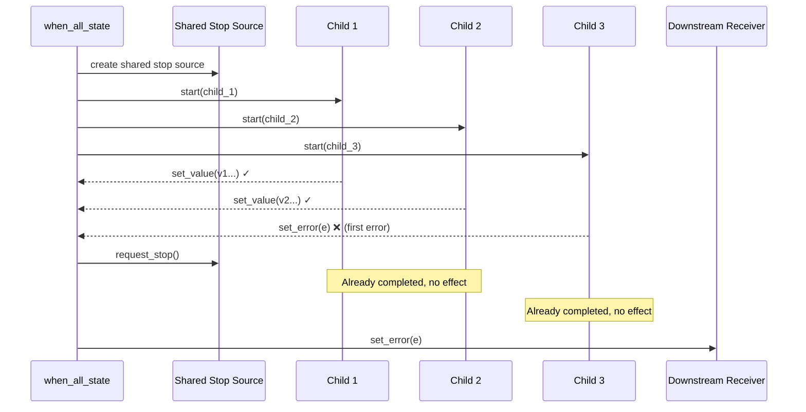
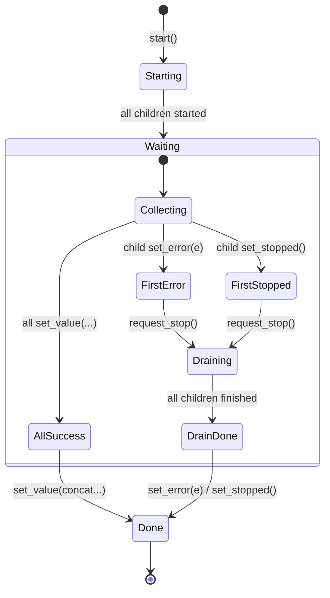
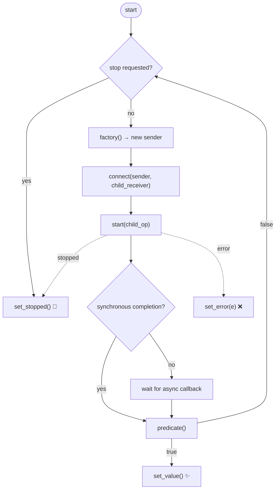

# Algorithms

## `when_all`

`when_all(a, b, ...)` starts all child senders and completes after all started
children have finished.

### Execution Model





### Basic Usage

```cpp
bexec::run_loop loop;
auto sched = loop.get_scheduler();

auto a = bexec::schedule(sched) | bexec::then([] {});
auto b = bexec::schedule(sched) | bexec::then([] {});

auto op = bexec::connect(bexec::when_all(std::move(a), std::move(b)), receiver{});
bexec::start(op);
loop.finish();
loop.run();
```

### All-Success Completion

All-success completion sends concatenated child values in argument order:

```cpp
auto result = bexec::this_thread::sync_wait(
    bexec::when_all(bexec::just(1, 2), bexec::just(std::string{"ok"})));

// result has type std::optional<std::tuple<int, int, std::string>>
// result contains tuple{1, 2, "ok"}
```

### Error and Stopped Handling

On the first error or stopped signal, `when_all` requests stop through its
internal stop source and waits for all started children to finish before
completing the receiver. Errors are delivered as their original error type;
`std::exception_ptr` is also listed to cover internal connect/start failures.

If the receiver environment has a stoppable token, requesting that token also
requests stop for all child senders through the `when_all` environment.

### `when_all` vs `when_all_with_variant`

Plain `when_all` requires each child sender to have at most one value completion
alternative. Use `when_all_with_variant` for senders with multiple value
alternatives:

```cpp
auto s = bexec::when_all_with_variant(maybe_int_or_string(), bexec::just(3));
```

`when_all_with_variant` applies `into_variant` to each child before passing to
`when_all`.

### Limitations

`when_all()` and `when_all_with_variant()` with zero senders are ill-formed.

## `repeat_until`

`repeat_until(factory, predicate)` repeatedly creates and starts a fresh child
sender. After each successful child completion, `predicate()` is called. When the
predicate returns `true`, the repeat sender completes with `set_value()`.

### Execution Model



```cpp
int count = 0;

auto repeated = bexec::repeat_until(
    [&] {
        return bexec::just() | bexec::then([&] { ++count; });
    },
    [&] { return count == 10; });

auto op = bexec::connect(std::move(repeated), receiver{});
bexec::start(op);
// After 10 iterations, receiver receives set_value()
```

### Design Notes

Child values are discarded. The factory form is intentional: it avoids restarting
the same operation state (which would be invalid for many senders), and works for
move-only senders.

The implementation uses a trampoline so synchronous children such as `just()` do
not recursively call `start()` and do not grow the stack per iteration.

### Error and Stop Propagation

Child errors and stopped signals are propagated directly to the receiver.
Cancellation is checked through the receiver environment before each iteration.
