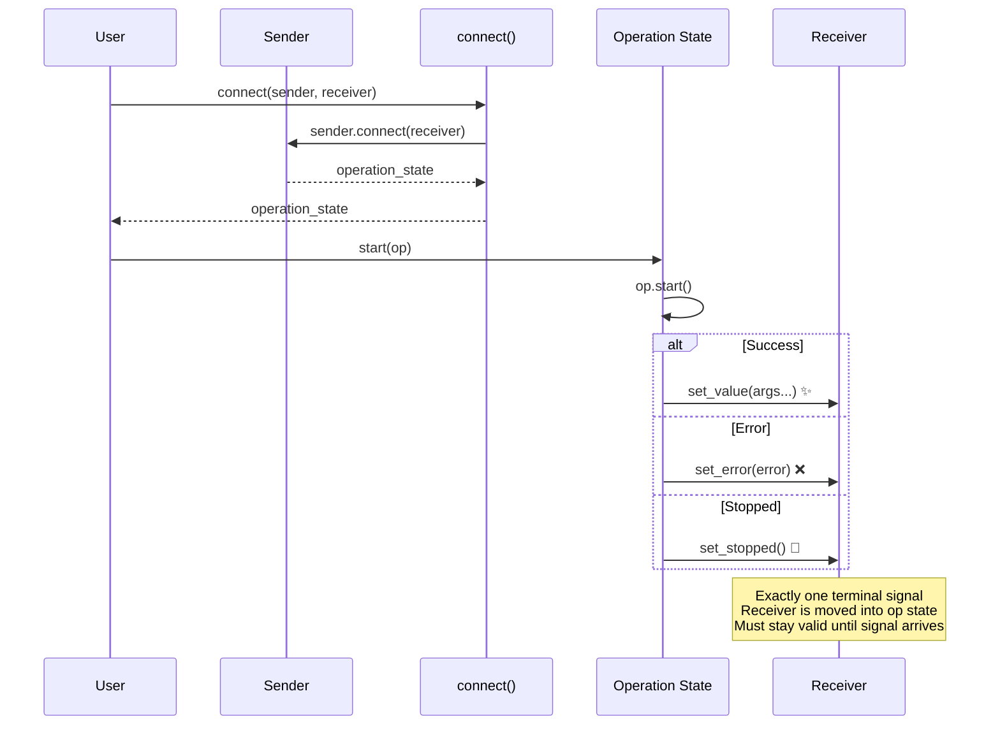

# Basic Sender/Receiver

A sender is connected to a receiver to produce an operation state. Starting the
operation eventually delivers exactly one terminal signal to the receiver:

- `set_value(args...)` — success with values
- `set_error(error)` — an error occurred
- `set_stopped()` — the operation was cancelled

## Lifecycle



## Defining a Receiver

A receiver must provide three `noexcept` member functions, one for each terminal
signal:

```cpp
struct receiver {
    void set_value(int value) noexcept {
        // use value
    }

    void set_error(std::exception_ptr error) noexcept {
        // handle error
    }

    void set_stopped() noexcept {
        // handle cancellation
    }
};
```

## Connect and Start

```cpp
auto op = bexec::connect(bexec::just(1), receiver{});
bexec::start(op);
```

`bexec::connect(sender, receiver)` calls `sender.connect(receiver)` to produce an
operation state. `bexec::start(op)` calls `op.start()` to launch the async work.

## Receiver Lifetime

Receivers are moved into operation states. The library assumes a receiver stays
valid until it receives its terminal signal. Implementations must ensure the
receiver's address remains stable while the operation is alive — child receivers
inside operation states typically store pointers back to the parent operation
state rather than sharing ownership.

## Completion Contract

Each operation state delivers exactly one terminal signal after `start()`. The
library does not retain references to a receiver after terminal completion, unless
the user-defined receiver type itself holds shared state.

Operation states are single-start objects. Starting an operation more than once
is outside the supported contract.
