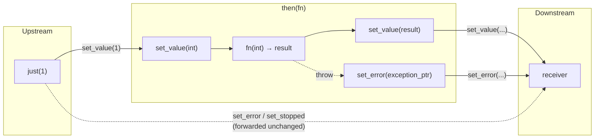

# Completion Adaptors

`then`, `upon_error`, and `upon_stopped` are value-transforming adaptors. They
convert one completion kind into a `set_value` completion. `into_variant`
collapses multiple value completions into a single variant value.

All adaptors can be used as free functions or through pipe syntax.

## Pipeline Transformation



## `then`

`then(fn)` transforms `set_value`. Upstream `set_value(args...)` is mapped to
`set_value(fn(args...))`.

```cpp
auto s = bexec::just(1) | bexec::then([](int x) {
    return x + 1;
});
// receiver receives set_value(2)
```

### Void Return

If `fn` returns `void`, the downstream receiver gets `set_value()` with no values.

### Exceptions

When exceptions are enabled, exceptions thrown by `fn` are delivered as
`set_error(std::exception_ptr)`. With exceptions disabled, throwing callables are
not supported.

### Forwarding

Non-selected completions (`set_error`, `set_stopped`) are forwarded unchanged to
the downstream receiver.

## `upon_error`

`upon_error(fn)` transforms `set_error`. Upstream `set_error(error)` is mapped
to `set_value(fn(error))`.

```cpp
auto recovered = bexec::just_error(5) | bexec::upon_error([](int code) {
    return code + 1;
});
// receiver receives set_value(6)
```

## `upon_stopped`

`upon_stopped(fn)` transforms `set_stopped`. Upstream `set_stopped()` is mapped
to `set_value(fn())`.

```cpp
auto fallback = bexec::just_stopped() | bexec::upon_stopped([] {
    return 42;
});
// receiver receives set_value(42)
```

## Adaptor Composition


## Direct Call Syntax

In addition to pipe syntax, adaptors can be called directly:

```cpp
auto s = bexec::then(bexec::just(1), [](int x) { return x + 1; });
```

## Completion Signature Transformation

`then`, `upon_error`, and `upon_stopped` turn the selected completion kind into a
value completion and always add `std::exception_ptr` to possible errors (to cover
callable or connect failures). Non-selected completion signatures are preserved
as-is.

## `into_variant`

`into_variant(sender)` maps every successful value completion into a single
`std::variant<std::tuple<...>, ...>` value. Duplicate tuple alternatives are
removed from the variant type. Errors and stopped completion are forwarded
unchanged.

```cpp
auto s = bexec::into_variant(maybe_int_or_string());
// If maybe_int_or_string can complete as set_value(int) or set_value(std::string)
// the result is set_value(std::variant<std::tuple<int>, std::tuple<std::string>>)
```

`when_all_with_variant` internally applies `into_variant` to each child sender
before passing them to `when_all`.
