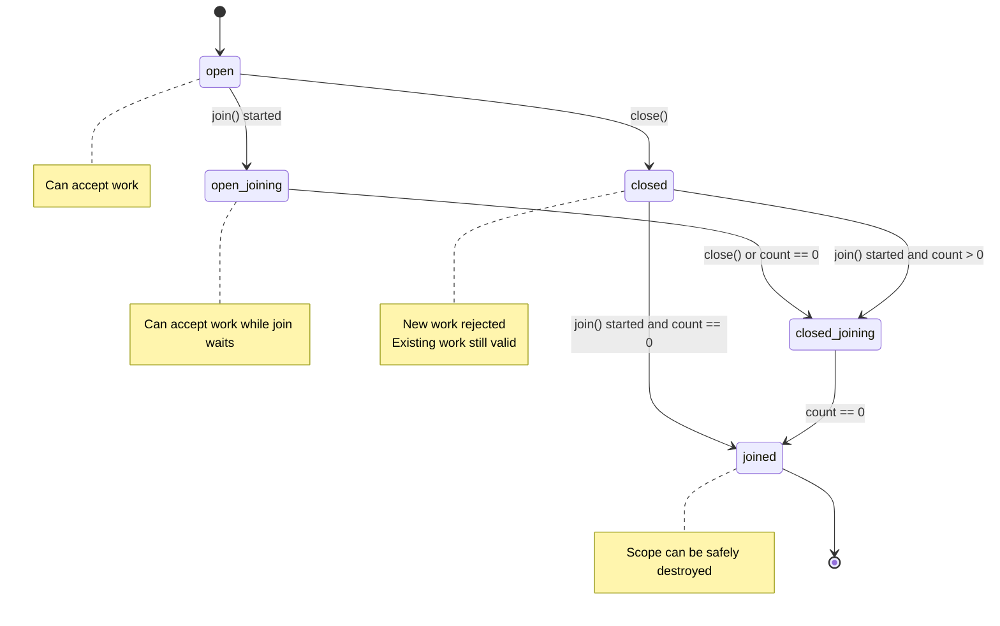
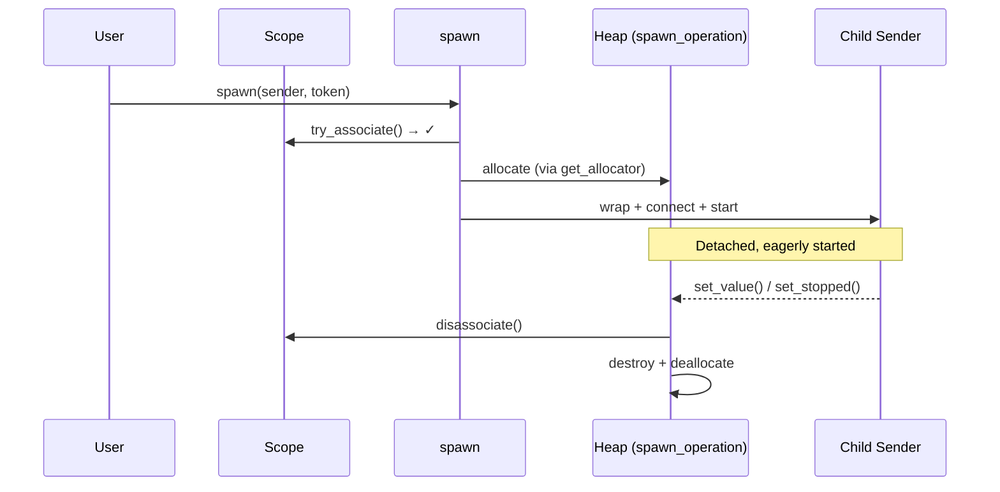
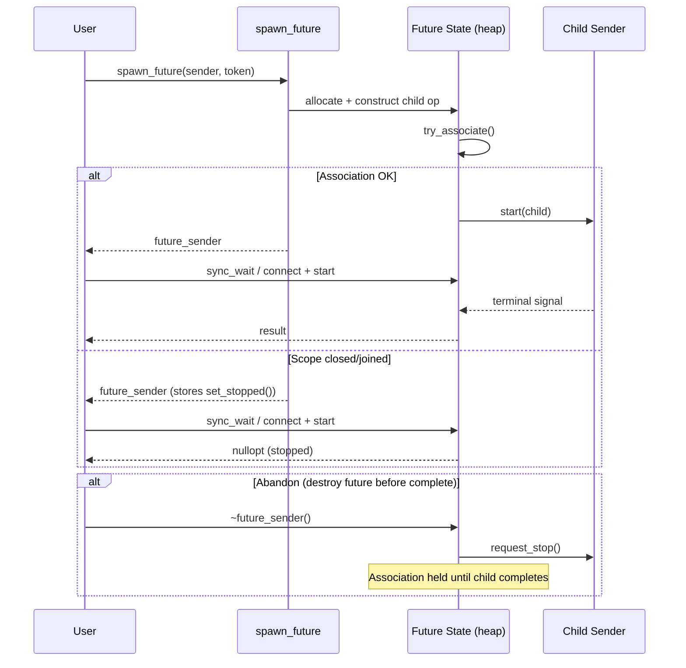

# Counting Scopes

Counting scopes track outstanding associated work. `simple_counting_scope` tracks
an association count; `counting_scope` adds cooperative cancellation via
`request_stop()`.

## Scope State Machine



### Creating a Scope and Token

```cpp
bexec::counting_scope scope;
auto token = scope.get_token();
```

Work is associated with the scope through a scope token.

## `spawn`

`spawn(sender, token)` eagerly starts detached work and keeps the scope
associated until the child completes. Detached spawned senders must complete only
with `set_value()` and/or `set_stopped()`.



```cpp
bexec::spawn(bexec::just() | bexec::then([] {
    // Fire-and-forget work
}), token);
```

## `spawn_future`

`spawn_future(sender, token)` eagerly starts the input sender and returns a
move-only sender that later consumes the stored result:



```cpp
auto future = bexec::spawn_future(bexec::just(42), token);
auto result = bexec::this_thread::sync_wait(std::move(future));

if (result) {
    auto [value] = *result;
}
```

### spawn_future Behavior Details

- If the scope is already closed or joined, `spawn_future` does not start the
  input sender and the returned sender completes with `set_stopped()`.
- Destroying the returned future sender before the child completes **abandons the
  future and requests stop** for the child; however, the scope association is
  still released only when the child eventually completes.
- Abandoning the future does not complete the future receiver with stopped. It
  only requests stop for the child.

## Scope Lifecycle

### `close()`

Prevents new associations. Existing work remains valid.

### `join()`

Returns a sender that completes when the association count reaches zero. Starting
a join does **not** immediately close a non-empty open scope to new work; the
scope still accepts associations while it is `open_joining`. Once the count
reaches zero, the join path closes the scope before completing.

```cpp
scope.close();
auto result = bexec::this_thread::sync_wait(scope.join());
```

The receiver used with `join()` must expose `get_scheduler` through its
environment; `this_thread::sync_wait(scope.join())` satisfies this requirement.

### Destruction

Destroying a scope while it has outstanding associations or a pending join
terminates the program.
Callers must close and join scopes that have accepted work before destroying them.

## `simple_counting_scope` vs `counting_scope`

- `simple_counting_scope` only tracks the association count (`close()`, `join()`).
- `counting_scope` additionally owns an `inplace_stop_source`; its token wraps
  child senders so scope stop requests are visible through `get_stop_token` to
  children. Call `request_stop()` to trigger cooperative cancellation.

```cpp
bexec::counting_scope scope;        // with cancellation support
bexec::simple_counting_scope scope; // count only
```
