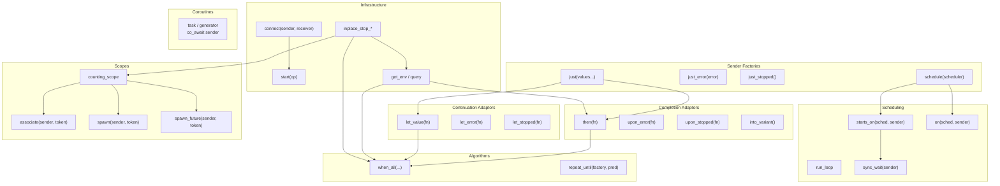

# Usage

bexec is a C++20 header-only sender/receiver concurrency library inspired by
P2300. All public APIs are available through `#include <bexec/bexec.hpp>`.

## Architecture Overview



## Quick Start

```cpp
#include <bexec/bexec.hpp>

struct receiver {
    void set_value(int value) noexcept { /* use value */ }
    void set_error(std::exception_ptr error) noexcept { /* handle error */ }
    void set_stopped() noexcept { /* handle cancellation */ }
};

auto s = bexec::just(1) | bexec::then([](int x) { return x + 1; });
auto op = bexec::connect(std::move(s), receiver{});
bexec::start(op);
```

## Documentation Index

| Document | Contents |
|----------|----------|
| [basic-sender-receiver.md](basic-sender-receiver.md) | Sender/receiver fundamentals, connect/start flow, receiver contract |
| [sender-factories.md](sender-factories.md) | `just`, `just_error`, `just_stopped` sender factories |
| [completion-adaptors.md](completion-adaptors.md) | `then`, `upon_error`, `upon_stopped` completion adaptors, `into_variant` |
| [let-adaptors.md](let-adaptors.md) | `let_value`, `let_error`, `let_stopped` continuation adaptors |
| [scheduling.md](scheduling.md) | `run_loop` scheduler, `starts_on`/`on`, `schedule`, `sync_wait` |
| [stop-tokens.md](stop-tokens.md) | `inplace_stop_source`, `inplace_stop_token`, `inplace_stop_callback` |
| [environments.md](environments.md) | Environment queries: `get_env`, `get_stop_token`, `get_allocator`, `get_scheduler`, environment wrappers |
| [concepts-and-metadata.md](concepts-and-metadata.md) | Concept constraints, completion signature introspection |
| [algorithms.md](algorithms.md) | `when_all`, `when_all_with_variant`, `repeat_until` |
| [counting-scopes.md](counting-scopes.md) | `counting_scope`, `simple_counting_scope`, `associate`, `spawn`, `spawn_future` |
| [coroutines.md](coroutines.md) | Sender awaiting, `task<T>`, and synchronous `generator<T>` |

## Other Documentation

- [README.md](../../README.md) — Project overview, build instructions, limitations
- [design.md](../design.md) — Design rationale and architectural decisions
- [maintenance.md](../maintenance.md) — Maintainer guide (code layout, naming, how to add features)
- [roadmap.md](../roadmap.md) — Planned improvements
