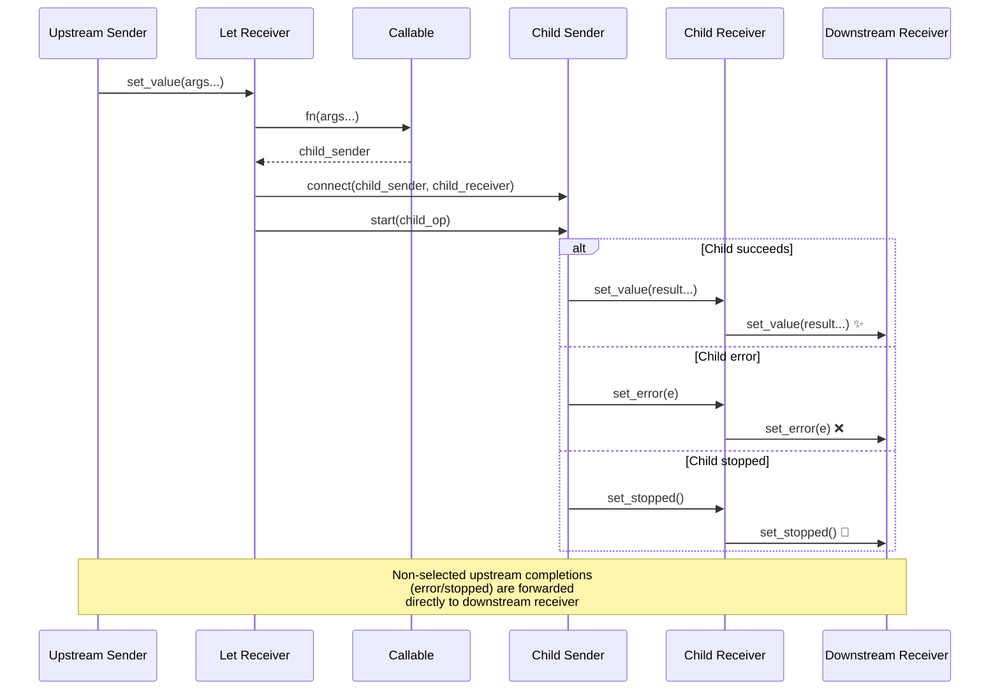
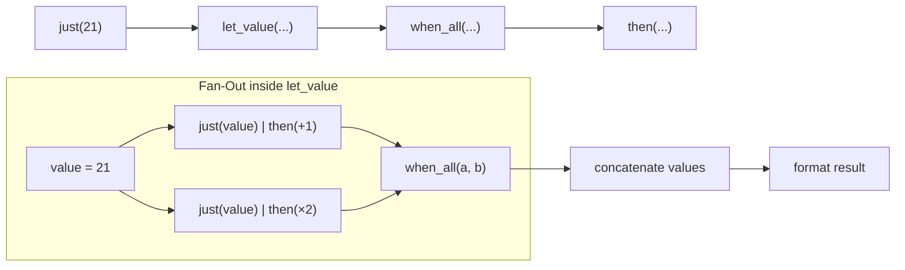

# Let Adaptors

`let_value`, `let_error`, and `let_stopped` are continuation adaptors. Unlike
`then`/`upon_*`, the callable passed to a let adaptor must return a **sender**
rather than a value. This makes them suitable for fanning out an upstream value
to multiple downstream paths, or for launching async child operations.

## Execution Model



## Comparison with `then`/`upon_*`

| Adaptor | Callable returns | Use case |
|---------|-----------------|----------|
| `then` | value | Simple value transformation |
| `upon_error` | value | Error recovery to a value |
| `upon_stopped` | value | Fallback value on stop |
| `let_value` | sender | Launch async child work, or fan-out to multiple paths |
| `let_error` | sender | Error recovery requiring async work |
| `let_stopped` | sender | Stop handling requiring async work |

## `let_value`

`let_value(sender, fn)` calls `fn(args...)` when the upstream sends
`set_value(args...)`. The callable must return a sender. That child sender is
connected and started immediately, and its terminal signal is delivered directly
to the downstream receiver.

```cpp
auto s = bexec::just(2) | bexec::let_value([](int value) {
    return bexec::just(value + 40);
});
// receiver receives set_value(42)
```

### Move-Only Values

```cpp
auto s = bexec::just(std::make_unique<int>(20))
    | bexec::let_value([](std::unique_ptr<int> value) {
          *value += 22;
          return bexec::just(std::move(value));
      });
```

### Fan-Out Pattern

The most common use of `let_value` is fanning a single upstream value out to
multiple parallel downstream operations. Combined with `when_all`, this
implements the "poor man's split" pattern:



```cpp
auto value_fanout = bexec::just(21)
    | bexec::let_value([](int value) {
          return bexec::when_all(
              bexec::just(value) | bexec::then([](int item) { return item + 1; }),
              bexec::just(value) | bexec::then([](int item) { return item * 2; }));
      })
    | bexec::then([](int plus_one, int doubled) {
          return std::to_string(plus_one) + ", " + std::to_string(doubled);
      });
// receiver receives set_value("22, 42")
```

### Async Fan-Out

When the upstream is async, use `let_value` with a scheduler to fan out the
result to multiple paths. Note: shared state in a fan-out must be managed via
`shared_ptr`, since each child sender needs independent ownership of the data:

```cpp
bexec::run_loop loop;
auto sched = loop.get_scheduler();

auto async_fanout = bexec::schedule(sched)
    | bexec::then([] { return expensive_result(); })
    | bexec::let_value([sched](auto result) {
          auto shared = std::make_shared<decltype(result)>(std::move(result));
          return bexec::when_all(
              bexec::schedule(sched) | bexec::then([shared] { return process_a(*shared); }),
              bexec::schedule(sched) | bexec::then([shared] { return process_b(*shared); }));
      });
```

## `let_error`

`let_error(sender, fn)` calls `fn(error)` when the upstream sends
`set_error(error)`. The callable must return a sender, whose terminal signal is
delivered to the downstream receiver. This is useful for error recovery that
requires async work.

```cpp
auto recovered = bexec::just_error(std::string{"missing config"})
    | bexec::let_error([](std::string reason) {
          // Error recovery: log the reason and return a fallback value
          return bexec::just(std::string{"recovered from "} + reason);
      });
// receiver receives set_value("recovered from missing config")
```

`let_error` can also fan out an error to multiple handling paths:

```cpp
auto error_fanout = bexec::just_error(std::string{"timeout"})
    | bexec::let_error([](std::string reason) {
          return bexec::when_all(
              bexec::just(std::string{"logged "} + reason),
              bexec::just(std::string{"fallback ready"}));
      })
    | bexec::then([](std::string logged, std::string fallback) {
          return logged + "; " + fallback;
      });
```

## `let_stopped`

`let_stopped(sender, fn)` calls `fn()` when the upstream sends `set_stopped()`.
The callable must return a sender, whose terminal signal is delivered to the
downstream receiver.

```cpp
auto fallback = bexec::just_stopped()
    | bexec::let_stopped([] {
          return bexec::just(7);
      });
// receiver receives set_value(7)
```

Multi-step cleanup on stop via `when_all`:

```cpp
auto stopped_cleanup = bexec::just_stopped()
    | bexec::let_stopped([] {
          return bexec::when_all(
              bexec::just(std::string{"notified stop"}),
              bexec::just(std::string{"released resources"}));
      })
    | bexec::then([](std::string notice, std::string cleanup) {
          return notice + "; " + cleanup;
      });
```

## Pipe Syntax

All three adaptors support pipe syntax:

```cpp
sender | bexec::let_value(fn)
sender | bexec::let_error(fn)
sender | bexec::let_stopped(fn)
```

Direct call syntax is also available:

```cpp
bexec::let_value(sender, fn)
bexec::let_error(sender, fn)
bexec::let_stopped(sender, fn)
```

## Completion Signatures

The child sender's completion signatures become the result. Non-selected upstream
completions are preserved as-is. When exceptions are enabled, exceptions thrown
by the callable or during child sender connection are delivered as
`set_error(std::exception_ptr)`.
