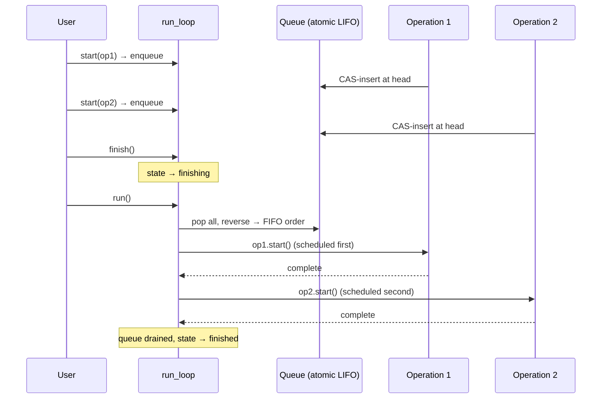
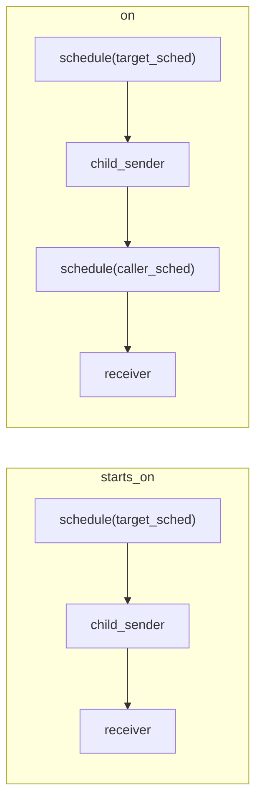

# Scheduling

## `run_loop`

`run_loop` is a stack-owned FIFO scheduler whose queue stores operation pointers
intrusively. It is useful for local tests, hand-written blocking waits, and
`this_thread::sync_wait`.

### Execution Model



```cpp
bexec::run_loop loop;

auto op = bexec::connect(
    bexec::starts_on(loop.get_scheduler(), bexec::just(7)),
    receiver{});

bexec::start(op);
loop.finish();   // request drain
loop.run();      // block until queue is empty
```

Typical lifecycle:
1. Create a `run_loop`
2. Obtain the scheduler via `loop.get_scheduler()`
3. Connect and start senders
4. Call `loop.finish()` to signal drain
5. Call `loop.run()` to block and execute queued work until completion

## `schedule(scheduler)`

`bexec::schedule(scheduler)` is a standalone sender factory that calls
`scheduler.schedule()` to create a sender that completes on the scheduler's
execution context.

```cpp
bexec::run_loop loop;
auto sched = loop.get_scheduler();

auto s = bexec::schedule(sched) | bexec::then([] {
    // This work runs when loop.run() drains the queue
    return 1;
});

auto op = bexec::connect(std::move(s), receiver{});
bexec::start(op);
loop.finish();
loop.run();
```

Multiple `schedule` operations can be enqueued on the same `run_loop`:

```cpp
auto first = bexec::schedule(sched) | bexec::then([] { return 1; });
auto second = bexec::schedule(sched) | bexec::then([] { return 2; });

bexec::start(bexec::connect(std::move(first), receiver_a{}));
bexec::start(bexec::connect(std::move(second), receiver_b{}));
loop.finish();
loop.run();
```

## `starts_on` and `on`



### `starts_on`

`starts_on(scheduler, sender)` first completes `schedule(scheduler)`, then
starts the child sender on that execution resource.

```cpp
auto s = bexec::starts_on(loop.get_scheduler(), bexec::just(7));
```

Schedule errors and stopped signals are forwarded to the downstream receiver.

### `on`

`on(scheduler, sender)` starts the child through the target scheduler and
schedules final delivery back through
`get_scheduler(get_env(receiver))`.

```cpp
bexec::run_loop target;
bexec::run_loop caller;

// The receiver's environment must answer get_scheduler with caller's scheduler
auto s = bexec::on(target.get_scheduler(), bexec::just(1));
```

Connecting an `on` sender is ill-formed when the receiver environment has no
`get_scheduler` query.

## `sync_wait`

`bexec::this_thread::sync_wait(sender)` starts a sender and blocks the current
thread by running a local `run_loop`. A value completion returns
`std::optional<std::tuple<...>>`; stopped returns `std::nullopt`; errors are
thrown (`std::exception_ptr` is rethrown).

```cpp
auto value = bexec::this_thread::sync_wait(bexec::just(1));
// value has type std::optional<std::tuple<int>>
// on value: *value == std::tuple{1}
// on stopped: value == std::nullopt
// on error: exception is thrown
```

```cpp
auto result = bexec::this_thread::sync_wait(
    bexec::when_all(bexec::just(1, 2), bexec::just(std::string{"ok"})));

// result has type std::optional<std::tuple<int, int, std::string>>
if (result) {
    auto& [a, b, c] = *result;
}
```

### `sync_wait_with_variant`

`sync_wait_with_variant(sender)` is the variant-returning form for senders with
multiple value alternatives. It returns
`std::optional<std::variant<std::tuple<...>, ...>>`.

```cpp
auto result = bexec::this_thread::sync_wait_with_variant(multi_value_sender());
if (result) {
    std::visit([](const auto& tuple) { /* ... */ }, *result);
}
```
